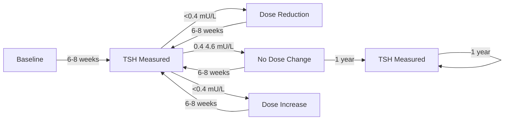

#### Conditional Activities

Conditional activities only occur based on some pre-existing state for the patient at the point of time the activity would be performed. We limit the scope to elements defined by ActivityDefinitions, changes in Patient CRF relating to branching or similar are described in [Dynamic Visit Plans](dynamic-visit-plans.html).  The invocation of conditional activities relies on an evaluation of the state at the point at which the activity would be planned to be performed. These states can be characteristics of the patient (pre-entry states) or can be based on emergent events.

Conditional classifications could include:
- Patient pre-existing conditions
  - activities that are dependent on one or more disease, problem or diagnosis that there is evidence for in the medical record
- Patient characteristics
  - activities are predicated on a patient characteristic that is not specifically related to a diagnosis (eg patient sexual characteristics)
  - activities that are done in addition to the core activities based on an emergent event (eg Adverse event monitoring in the event of suspected liver damage)
- Study Characteristics
  - pre-determined changes to the operation of the study, 
    - activities that depend on site location (eg sites requiring specific constraints based on local regulations)
    - activities with with specific consent requirements (eg Exploratory activities requiring extended consent) 
- Operational Requirements
  - Activities that have a pre-requisite on site capabilities (eg requiring a MRI scan could preclude a site from meeting Site requirements)

Some examples taken from real protocols are shown here:
- Patients who are diabetics should have hemoglobin A1c tests
  ```
  If patients are insulin dependent diabetics, a hemoglobin A1c will be obtained.
  ```
- Evidence of suspected liver damage
  ```
  The following criteria have been developed to monitor hepatic function.
    * Patients with ALT/SGPT levels >120 IU will be retested weekly.
    * Patients with ALT/SGPT values >400 IU, or alternatively, an elevated
      ALT/SGPT accompanied by GGT and/or ALP values >500 IU will be
      retested within 2 days...
  ```
- Pregnancy tests for females of child-bearing potential
  ```
  Serum (at baseline) or urine human chorionic gonadotropin (hCG) pregnancy test (as needed for females of childbearing potential). (urine pregnancy test on Day 1 of each cycle, EOT visit, and every 30±7 days until 5 months after last dose of study treatment)
  ```
- Disease Response assessment based on the type and location of the disease under treatment:
  ```
  HCC, hepatocellular carcinoma, requiring an MRI or CT scan and GBM, glioblastoma, requiring a Brain MRI
  ```

We have used existing patterns within the FHIR [PlanDefinition](https://hl7.org/fhir/plandefinition.html) resource to assist with conditional activities defined according to patient characteristics. The [PlanDefinition](https://hl7.org/fhir/plandefinition.html) predicate for child activities, [PlanDefinition.action](https://hl7.org/fhir/plandefinition-definitions.html#PlanDefinition.action) provides a framework, however other approaches can be applied.  It is approached using the [condition](https://hl7.org/fhir/plandefinition-definitions.html#PlanDefinition.action.condition) attribute on the `action`; the `kind` predicate is set to `applicability` which reflects the concept of a conditional activity.

In our testing, some patterns that are handled within existing data collection strategies did not simply map across to existing examples.  Examples included the concept of 'Child-bearing Potential', which is a pre-condition to requiring a Pregnancy Test.  It was not possible to simply formulate the necessary [FHIRPath](https://build.fhir.org/fhirpath.html); instead we proposed a way of direct querying the system user, in the same way that it is achieved in   

We appreciate that there are a wide number of possible implementations for many patient characteristics; so we cannot provide a simple pattern to do this, instead we can provide some examples that show how logic can be applied to the scheduling of activities such that the conditionality expressed in the protocol can be adequately reflected in the planned study design.


##### Example I: HBA1c in Diabetes Mellitus 
Given the following protocol design element,

```
If patients are insulin dependent diabetics, a hemoglobin A1c will be obtained.
```
For an example, see the following sample:

```yaml
Instance: SoA-PoC-Conditional-Visit-1
InstanceOf: StudyVisitSoa
Usage: #inline
* status = #active
* title = "Visit 1 - Screening"
* action[+]
  * definitionCanonical = "ActivityDefinition/BloodChemistry-ActivityDefinition"
  * title = "Blood Chemistry"
* action[+]
  * definitionCanonical = "ActivityDefinition/BloodChemistry-HBA1C-ActivityDefinition"
  * title = "Blood Chemistry - Diabetic"
  * condition[+]
    * kind = #applicability
    * expression
      * description = "Blood Chemistry with HbA1c"
      * language = #text/fhirpath
      * expression = "Condition.where(subject.reference = 'Patient/' + Id).where(code.coding.system = 'http://snomed.info/sct' and code.coding.code = '46635009').exists()"
```
This uses the [FHIRPath](https://build.fhir.org/fhirpath.html) statement to identify that the current Patient has evidence of a diagnosis of Diabetes Mellitus; if this is true then the activity is applicable and should be performed.  Note, this is limiting the search to just a diagnosis code using SNOMED, whereas other coding systems may be in use dependent on the system and location.  

This might be an example where the use of [Clinical Quality Language](https://build.fhir.org/ig/HL7/cql/) (CQL) adds additional flexibility through the use of complex functions that exceed the pattern matching in FHIRPath.  It should be up to the implementer and systems involved to ensure the requirement is communicated with sufficient clarity in a way that it can be implemented.

##### Example II: Patient has completed Inclusion/Exclusion
Continued Study activities are dependent on ResearchSubject having completed all applicable Eligibility; assuming they have failed then the activities remaining would only be those that apply to a Screen Failure

```yaml
Instance: SoA-PoC-Conditional-Screening-Eligibility
InstanceOf: StudyVisitSoa
Usage: #inline
* status = #active
* title = "Visit 1 - Screening"
* action[+]
  * definitionCanonical = "ActivityDefinition/Eligibility-Evaluation"
  * description = "Evaluate the Patient eligibility status"
* action[+]
  * definitionCanonical = "Questionnaire/Collect-Screen-Fail"
  * description = "Complete the Primary Reason for Screen Failure"
  * condition[+]
    * kind = #applicability
    * expression
      * description = "Record Screen Failure Reason"
      * language = #text/fhirpath
      * expression = "ResearchSubject.where(subject.reference = 'Patient/' + Id).where(study.name = 'RESEARCHSTUDY').subjectState.coding.where(code = 'ineligible').exists()"
* action[+]
  ... default study activities
```
In this example we assume that patient failing screening would have a `subjectState` of [*ineligible*](https://terminology.hl7.org/7.1.0/en/CodeSystem-research-subject-state.html#research-subject-state-ineligible); if the FHIRPath matches then the Questionnaire to record the primary reason for Screen Failure should be shown.  If the patient is eligible then the normal study progression would occur (there are better implementations of this using the [dynamic visit plans](dynamic-visit-plans.html), this is purely illustrative).

Dose titration is used to establish the lowest effective dose that provides the patient with an optimal therapeutic effect with minimal side effects (ref). The key principles of dose titration are:

- establish a baseline measurement relevant to the medication's purpose
- start medication with the lowest effective dose as recommended in clinical guidelines
- allow sufficient time between dose adjustments for the medication to reach steady state 
- monitor the patient's response using objective measures and subjective symptom reports at each step
- increase or decrease the dose incrementally until an acceptable therapeutic response is reached, intolerable side effects occur or the maximum recommended dose is reached.


**Levothyroxine** is primarily prescribed to treat hypothyroidism and should be monitored regularly following establishing an effective dose to maintain T4 and TSH within the normal range. The flowchart below shows the basic approach to establish an initial acceptable dose, and thereafter monitoring the thyroxine therapy(adapted from ...).   


The Baseline, Titration-Review, Maintenance-Review schedule defined using IG 2 extension is shown below.

```yaml
Instance: Levothroxine-Monitoring-Schedule
InstanceOf: PlanDefinition
Usage: #example
* meta
  * versionId = "0"
  * lastUpdated = "2026-03-11T15:57:04Z"
* identifier
  * system = "http://www.fhir4pharma.com/plandefinition"
  * value = "71379aa0-f176-4138-b54a-d40c1ef56137"
* version = "V00"
* name = "Levothroxine-Monitoring"
* title = "Levothroxine-Monitoring"
* type = $plan-definition-type#clinical-protocol
* status = #active
* publisher = "fhir4pharma [Richardson & Genyn, JMIR Med Inform 2025;13:e71430, DOI: 10.2196/71430]"
* description = "Levothroxine-Monitoring"
* action[0]
  * id = "81b27f5e-ea81-46de-8e87-311254f3f2d5"
  * definitionCanonical = "Encounter/Levothroxine-Monitoring-IS"
  * title = "IS"
  * description = "Interactions Start"
  * extension
    * extension[0]
      * url = "soaPlannedTimePoint"
      * valueQuantity = 0.0 's'
    * extension[+]
      * url = "soaReferenceTimePoint"
      * valueString = "IS"
    * extension[+]
      * url = "soaRepeatAllowed"
      * valueBoolean = "false"
    * extension[+]
      * url = "soaPlannedDuration"
      * valueDuration = 24.0 'h'
    * extension[+]
      * url = "soaTimePointType"
      * valueString = "Interaction"
    * extension[+]
      * url = "soaTimePointSubType"
      * valueString = "IS"
    * extension[+]
      * url = "soaPlannedRange"
      * valueRange
        * low = 24.0 'h'
        * high = 24.0 'h'
    * extension[+]
      * url = "soaRangeFromTimePoint"
      * valueString = "IS"
    * url = "http://fhir4pharma.com/StructureDefinition/soaPlannedTimepoint"
  * groupingBehavior = #visual-group
  * selectionBehavior = #exactly-one
  * action.extension
    * extension[0]
      * url = "soaTargetId"
      * valueString = "2980bedf-c17f-44be-8ee3-c4a00fa54f93"
    * extension[+]
      * url = "soaTransitionType"
      * valueString = "FS"
    * extension[+]
      * url = "soaTransitionDelay"
      * valueDuration = 6.0 'wk'
    * extension[+]
      * url = "soaTransitionRange"
      * valueRange
        * low = 0.0 's'
        * high = 0.0 's'
    * extension[+]
      * url = "soaTargetName"
      * valueString = "Baseline"
    * url = "http://fhir4pharma.com/StructureDefinition/soaTransition"
* action[+]
  * id = "2980bedf-c17f-44be-8ee3-c4a00fa54f93"
  * definitionCanonical = "Encounter/Levothroxine-Monitoring-Baseline"
  * title = "Baseline"
  * description = "Baseline"
  * extension
    * extension[0]
      * url = "soaPlannedTimePoint"
      * valueQuantity = 0.0 's'
    * extension[+]
      * url = "soaReferenceTimePoint"
      * valueString = "IS"
    * extension[+]
      * url = "soaRepeatAllowed"
      * valueBoolean = "true"
    * extension[+]
      * url = "soaPlannedDuration"
      * valueDuration = 24.0 'h'
    * extension[+]
      * url = "soaTimePointType"
      * valueString = "Interaction"
    * extension[+]
      * url = "soaTimePointSubType"
      * valueString = "V"
    * extension[+]
      * url = "soaPlannedRange"
      * valueRange
        * low = 0.0 's'
        * high = 0.0 's'
    * extension[+]
      * url = "soaRangeFromTimePoint"
      * valueString = "IS"
    * url = "http://fhir4pharma.com/StructureDefinition/soaPlannedTimepoint"
  * groupingBehavior = #visual-group
  * selectionBehavior = #exactly-one
  * action.extension
    * extension[0]
      * url = "soaTargetId"
      * valueString = "ce8c2cb1-db3a-4d03-8e59-0a7c50d027e1"
    * extension[+]
      * url = "soaTransitionType"
      * valueString = "FS"
    * extension[+]
      * url = "soaTransitionDelay"
      * valueDuration = 6.0 'wk'
    * extension[+]
      * url = "soaTransitionRange"
      * valueRange
        * low = 0.0 's'
        * high = 0.0 's'
    * extension[+]
      * url = "soaTargetName"
      * valueString = "Titration-Review"
    * url = "http://fhir4pharma.com/StructureDefinition/soaTransition"
* action[+]
  * id = "ce8c2cb1-db3a-4d03-8e59-0a7c50d027e1"
  * definitionCanonical = "Encounter/Levothroxine-Monitoring-Titration-Review"
  * title = "Titration-Review"
  * description = "Titration-Review"
  * extension
    * extension[0]
      * url = "soaPlannedTimePoint"
      * valueQuantity = 6.0 'wk'
    * extension[+]
      * url = "soaReferenceTimePoint"
      * valueString = "Baseline"
    * extension[+]
      * url = "soaRepeatAllowed"
      * valueBoolean = "true"
    * extension[+]
      * url = "soaPlannedDuration"
      * valueDuration = 24.0 'h'
    * extension[+]
      * url = "soaTimePointType"
      * valueString = "Interaction"
    * extension[+]
      * url = "soaTimePointSubType"
      * valueString = "V"
    * extension[+]
      * url = "soaPlannedRange"
      * valueRange
        * low = 0.0 's'
        * high = 14.0 'd'
    * extension[+]
      * url = "soaRangeFromTimePoint"
      * valueString = "Baseline"
    * url = "http://fhir4pharma.com/StructureDefinition/soaPlannedTimepoint"
  * groupingBehavior = #visual-group
  * selectionBehavior = #exactly-one
  * action[0]
    * extension
      * extension[0]
        * url = "soaTargetId"
        * valueString = "80bc5ed4-81f5-4c79-b93d-589f26017dc7"
      * extension[+]
        * url = "soaTransitionType"
        * valueString = "FS"
      * extension[+]
        * url = "soaTransitionDelay"
        * valueDuration = 0.0 's'
      * extension[+]
        * url = "soaTransitionRange"
        * valueRange
          * low = 0.0 's'
          * high = 0.0 's'
      * extension[+]
        * url = "soaTargetName"
        * valueString = "Maintenance-Review"
      * url = "http://fhir4pharma.com/StructureDefinition/soaTransition"
    * condition
      * kind = #start
      * expression
        * language = #text/x-soa-expressionplain
        * expression = "{'TSH Stabalised':'true','operation':'=='}"
  * action[+]
    * extension
      * extension[0]
        * url = "soaTargetId"
        * valueString = "ce8c2cb1-db3a-4d03-8e59-0a7c50d027e1"
      * extension[+]
        * url = "soaTransitionType"
        * valueString = "SS"
      * extension[+]
        * url = "soaTransitionDelay"
        * valueDuration = 0.0 's'
      * extension[+]
        * url = "soaTransitionRange"
        * valueRange
          * low = 7.0 'd'
          * high = 7.0 'd'
      * extension[+]
        * url = "soaTargetName"
        * valueString = "Titration-Review"
      * url = "http://fhir4pharma.com/StructureDefinition/soaTransition"
    * condition
      * kind = #start
      * expression
        * language = #text/x-soa-expressionplain
        * expression = "{'TSH  Stabalised':'false','operation':'=='}"
* action[+]
  * id = "80bc5ed4-81f5-4c79-b93d-589f26017dc7"
  * definitionCanonical = "Encounter/Levothroxine-Monitoring-Maintenance-Review"
  * title = "Maintenance-Review"
  * description = "Maintenance-Review"
  * extension
    * extension[0]
      * url = "soaPlannedTimePoint"
      * valueQuantity = 0.0 's'
    * extension[+]
      * url = "soaReferenceTimePoint"
      * valueString = "Titration-Review"
    * extension[+]
      * url = "soaRepeatAllowed"
      * valueBoolean = "true"
    * extension[+]
      * url = "soaPlannedDuration"
      * valueDuration = 24.0 'h'
    * extension[+]
      * url = "soaTimePointType"
      * valueString = "Interaction"
    * extension[+]
      * url = "soaTimePointSubType"
      * valueString = "V"
    * extension[+]
      * url = "soaPlannedRange"
      * valueRange
        * low = 0.0 's'
        * high = 0.0 's'
    * extension[+]
      * url = "soaRangeFromTimePoint"
      * valueString = "Titration-Review"
    * url = "http://fhir4pharma.com/StructureDefinition/soaPlannedTimepoint"
  * groupingBehavior = #visual-group
  * selectionBehavior = #exactly-one
  * action[0].extension
    * extension[0]
      * url = "soaTargetId"
      * valueString = "aa84af94-f8f5-44bb-aef9-ca50e0bfc94c"
    * extension[+]
      * url = "soaTransitionType"
      * valueString = "FS"
    * extension[+]
      * url = "soaTransitionDelay"
      * valueDuration = 0.0 's'
    * extension[+]
      * url = "soaTransitionRange"
      * valueRange
        * low = 0.0 's'
        * high = 0.0 's'
    * extension[+]
      * url = "soaTargetName"
      * valueString = "IF"
    * url = "http://fhir4pharma.com/StructureDefinition/soaTransition"
  * action[+].extension
    * extension[0]
      * url = "soaTargetId"
      * valueString = "80bc5ed4-81f5-4c79-b93d-589f26017dc7"
    * extension[+]
      * url = "soaTransitionType"
      * valueString = "FS"
    * extension[+]
      * url = "soaTransitionDelay"
      * valueDuration = 0.0 's'
    * extension[+]
      * url = "soaTransitionRange"
      * valueRange
        * low = 0.0 's'
        * high = 0.0 's'
    * extension[+]
      * url = "soaTargetName"
      * valueString = "Maintenance-Review"
    * url = "http://fhir4pharma.com/StructureDefinition/soaTransition"
  * action[+]
    * extension
      * extension[0]
        * url = "soaTargetId"
        * valueString = "ce8c2cb1-db3a-4d03-8e59-0a7c50d027e1"
      * extension[+]
        * url = "soaTransitionType"
        * valueString = "FS"
      * extension[+]
        * url = "soaTransitionDelay"
        * valueDuration = 0.0 's'
      * extension[+]
        * url = "soaTransitionRange"
        * valueRange
          * low = 0.0 's'
          * high = 0.0 's'
      * extension[+]
        * url = "soaTargetName"
        * valueString = "Titration-Review"
      * url = "http://fhir4pharma.com/StructureDefinition/soaTransition"
    * condition
      * kind = #start
      * expression
        * language = #text/x-soa-expressionplain
        * expression = "{'TSH In Range':'false','operation':'=='}"
* action[+]
  * id = "aa84af94-f8f5-44bb-aef9-ca50e0bfc94c"
  * definitionCanonical = "Encounter/Levothroxine-Monitoring-IF"
  * title = "IF"
  * description = "Interactions Finish"
  * extension
    * extension[0]
      * url = "soaPlannedTimePoint"
      * valueQuantity = 0.0 's'
    * extension[+]
      * url = "soaReferenceTimePoint"
      * valueString = "IS"
    * extension[+]
      * url = "soaRepeatAllowed"
      * valueBoolean = "false"
    * extension[+]
      * url = "soaPlannedDuration"
      * valueDuration = 24.0 'h'
    * extension[+]
      * url = "soaTimePointType"
      * valueString = "Interaction"
    * extension[+]
      * url = "soaTimePointSubType"
      * valueString = "IF"
    * extension[+]
      * url = "soaPlannedRange"
      * valueRange
        * low = 24.0 'h'
        * high = 24.0 'h'
    * extension[+]
      * url = "soaRangeFromTimePoint"
      * valueString = "IS"
    * url = "http://fhir4pharma.com/StructureDefinition/soaPlannedTimepoint"
```

The table below shows the key associated activities, where TSH and other relevant laboratory parameters are measured and then clinically reviewed to determine the required dose escalation or reduction.

##### Schedule of Activities: Levothroxine Monitoring [Table]

|                   | Baseline   | Titration-Review   | Maintenance-Review   |
|:------------------|:-----------|:-------------------|:---------------------|
| Blood Sample      | X          | X                  | X                    |
| TSH Measurement   | X          | X                  | X                    |
| Clinical Review   | X          | X                  | X                    |
| Increase Dose     |            | X                  |                      |
| No Dose Change    |            | X                  |                      |
| Decrease Dose     |            | X                  |                      |
| MedicationRequest | X          | X                  | X                    |

The Titration-Review activities defined using the IG 2.0 extensions is shown below.

```yaml
Instance: Levothroxine-Monitoring-Titration-Activities
InstanceOf: PlanDefinition
Usage: #example
* meta
  * versionId = "0"
  * lastUpdated = "2026-03-11T16:01:52Z"
* identifier
  * system = "http://www.fhir4pharma.com/plandefinition"
  * value = "c4ef9bcf-718f-421a-984e-45dae567935e"
* version = "V00"
* name = "Levothroxine-Monitoring"
* title = "Levothroxine-Monitoring"
* type = $plan-definition-type#clinical-protocol
* status = #active
* publisher = "fhir4pharma [Richardson & Genyn, JMIR Med Inform 2025;13:e71430, DOI: 10.2196/71430]"
* description = "Levothroxine-Monitoring"
* action[0]
  * id = "0088a1c5-86ff-4081-b8ac-d0ec38c31f40"
  * definitionCanonical = "http://fhir4pharma.com/ActivityDefinition/*|*"
  * title = "AS"
  * description = "Activity Start"
  * extension
    * extension[0]
      * url = "soaPlannedTimePoint"
      * valueQuantity = 0.0 's'
    * extension[+]
      * url = "soaReferenceTimePoint"
      * valueString = "AS"
    * extension[+]
      * url = "soaRepeatAllowed"
      * valueBoolean = "false"
    * extension[+]
      * url = "soaPlannedDuration"
      * valueDuration = 30.0 'min'
    * extension[+]
      * url = "soaTimePointType"
      * valueString = "Activity"
    * extension[+]
      * url = "soaTimePointSubType"
      * valueString = "AS"
    * extension[+]
      * url = "soaPlannedRange"
      * valueRange
        * low = 0.0 's'
        * high = 0.0 's'
    * extension[+]
      * url = "soaRangeFromTimePoint"
      * valueString = "AS"
    * url = "http://fhir4pharma.com/StructureDefinition/soaPlannedTimepoint"
  * groupingBehavior = #visual-group
  * selectionBehavior = #exactly-one
  * action.extension
    * extension[0]
      * url = "soaTargetId"
      * valueString = "82f88cb2-d416-4e67-8753-e24b55186873"
    * extension[+]
      * url = "soaTransitionType"
      * valueString = "FS"
    * extension[+]
      * url = "soaTransitionDelay"
      * valueDuration = 0.0 's'
    * extension[+]
      * url = "soaTransitionRange"
      * valueRange
        * low = 0.0 's'
        * high = 0.0 's'
    * extension[+]
      * url = "soaTargetName"
      * valueString = "Blood Sample"
    * url = "http://fhir4pharma.com/StructureDefinition/soaTransition"
* action[+]
  * id = "82f88cb2-d416-4e67-8753-e24b55186873"
  * definitionCanonical = "http://fhir4pharma.com/ActivityDefinition/*|*"
  * title = "Blood Sample"
  * description = "Blood Sample"
  * extension
    * extension[0]
      * url = "soaPlannedTimePoint"
      * valueQuantity = 0.0 's'
    * extension[+]
      * url = "soaReferenceTimePoint"
      * valueString = "AS"
    * extension[+]
      * url = "soaRepeatAllowed"
      * valueBoolean = "false"
    * extension[+]
      * url = "soaPlannedDuration"
      * valueDuration = 30.0 'min'
    * extension[+]
      * url = "soaTimePointType"
      * valueString = "Activity"
    * extension[+]
      * url = "soaTimePointSubType"
      * valueString = "A"
    * extension[+]
      * url = "soaPlannedRange"
      * valueRange
        * low = 0.0 's'
        * high = 0.0 's'
    * extension[+]
      * url = "soaRangeFromTimePoint"
      * valueString = "AS"
    * url = "http://fhir4pharma.com/StructureDefinition/soaPlannedTimepoint"
  * groupingBehavior = #visual-group
  * selectionBehavior = #exactly-one
  * action.extension
    * extension[0]
      * url = "soaTargetId"
      * valueString = "de868321-2d8c-4ca5-9aa2-8268ecbdc18a"
    * extension[+]
      * url = "soaTransitionType"
      * valueString = "FS"
    * extension[+]
      * url = "soaTransitionDelay"
      * valueDuration = 0.0 's'
    * extension[+]
      * url = "soaTransitionRange"
      * valueRange
        * low = 0.0 's'
        * high = 0.0 's'
    * extension[+]
      * url = "soaTargetName"
      * valueString = "TSH Measurement"
    * url = "http://fhir4pharma.com/StructureDefinition/soaTransition"
* action[+]
  * id = "de868321-2d8c-4ca5-9aa2-8268ecbdc18a"
  * definitionCanonical = "http://fhir4pharma.com/ActivityDefinition/*|*"
  * title = "TSH Measurement"
  * description = "TSH Measurement"
  * extension
    * extension[0]
      * url = "soaPlannedTimePoint"
      * valueQuantity = 0.0 's'
    * extension[+]
      * url = "soaReferenceTimePoint"
      * valueString = "AS"
    * extension[+]
      * url = "soaRepeatAllowed"
      * valueBoolean = "false"
    * extension[+]
      * url = "soaPlannedDuration"
      * valueDuration = 30.0 'min'
    * extension[+]
      * url = "soaTimePointType"
      * valueString = "Activity"
    * extension[+]
      * url = "soaTimePointSubType"
      * valueString = "A"
    * extension[+]
      * url = "soaPlannedRange"
      * valueRange
        * low = 0.0 's'
        * high = 0.0 's'
    * extension[+]
      * url = "soaRangeFromTimePoint"
      * valueString = "AS"
    * url = "http://fhir4pharma.com/StructureDefinition/soaPlannedTimepoint"
  * groupingBehavior = #visual-group
  * selectionBehavior = #exactly-one
  * action.extension
    * extension[0]
      * url = "soaTargetId"
      * valueString = "f63d8cb3-8589-4877-83fa-0e514398e785"
    * extension[+]
      * url = "soaTransitionType"
      * valueString = "FS"
    * extension[+]
      * url = "soaTransitionDelay"
      * valueDuration = 0.0 's'
    * extension[+]
      * url = "soaTransitionRange"
      * valueRange
        * low = 0.0 's'
        * high = 0.0 's'
    * extension[+]
      * url = "soaTargetName"
      * valueString = "Clinical Review"
    * url = "http://fhir4pharma.com/StructureDefinition/soaTransition"
* action[+]
  * id = "f63d8cb3-8589-4877-83fa-0e514398e785"
  * definitionCanonical = "http://fhir4pharma.com/ActivityDefinition/*|*"
  * title = "Clinical Review"
  * description = "Clinical Review"
  * extension
    * extension[0]
      * url = "soaPlannedTimePoint"
      * valueQuantity = 0.0 's'
    * extension[+]
      * url = "soaReferenceTimePoint"
      * valueString = "AS"
    * extension[+]
      * url = "soaRepeatAllowed"
      * valueBoolean = "false"
    * extension[+]
      * url = "soaPlannedDuration"
      * valueDuration = 30.0 'min'
    * extension[+]
      * url = "soaTimePointType"
      * valueString = "Activity"
    * extension[+]
      * url = "soaTimePointSubType"
      * valueString = "A"
    * extension[+]
      * url = "soaPlannedRange"
      * valueRange
        * low = 0.0 's'
        * high = 0.0 's'
    * extension[+]
      * url = "soaRangeFromTimePoint"
      * valueString = "AS"
    * url = "http://fhir4pharma.com/StructureDefinition/soaPlannedTimepoint"
  * groupingBehavior = #visual-group
  * selectionBehavior = #exactly-one
  * action[0]
    * extension
      * extension[0]
        * url = "soaTargetId"
        * valueString = "cabec7fd-917f-4d90-a294-cd3cddeb2d72"
      * extension[+]
        * url = "soaTransitionType"
        * valueString = "FS"
      * extension[+]
        * url = "soaTransitionDelay"
        * valueDuration = 0.0 's'
      * extension[+]
        * url = "soaTransitionRange"
        * valueRange
          * low = 0.0 's'
          * high = 0.0 's'
      * extension[+]
        * url = "soaTargetName"
        * valueString = "Increase Dose"
      * url = "http://fhir4pharma.com/StructureDefinition/soaTransition"
    * condition
      * kind = #start
      * expression
        * language = #text/x-soa-expressionplain
        * expression = "{'TSH >4.6mU/L':'true','operation':'=='}"
  * action[+]
    * extension
      * extension[0]
        * url = "soaTargetId"
        * valueString = "dfa9adda-33fd-4a78-b8b7-ba28aa807fe1"
      * extension[+]
        * url = "soaTransitionType"
        * valueString = "FS"
      * extension[+]
        * url = "soaTransitionDelay"
        * valueDuration = 0.0 's'
      * extension[+]
        * url = "soaTransitionRange"
        * valueRange
          * low = 0.0 's'
          * high = 0.0 's'
      * extension[+]
        * url = "soaTargetName"
        * valueString = "No Dose Change"
      * url = "http://fhir4pharma.com/StructureDefinition/soaTransition"
    * condition
      * kind = #start
      * expression
        * language = #text/x-soa-expressionplain
        * expression = "{'TSH 0.4-4.6mU/L':'true','operation':'=='}"
  * action[+]
    * extension
      * extension[0]
        * url = "soaTargetId"
        * valueString = "0b1f8a61-d934-428a-887e-e4e5bfb834e1"
      * extension[+]
        * url = "soaTransitionType"
        * valueString = "FS"
      * extension[+]
        * url = "soaTransitionDelay"
        * valueDuration = 0.0 's'
      * extension[+]
        * url = "soaTransitionRange"
        * valueRange
          * low = 0.0 's'
          * high = 0.0 's'
      * extension[+]
        * url = "soaTargetName"
        * valueString = "Decrease Dose"
      * url = "http://fhir4pharma.com/StructureDefinition/soaTransition"
    * condition
      * kind = #start
      * expression
        * language = #text/x-soa-expressionplain
        * expression = "{'TSH <0.4mU/L':'true','operation':'=='}"
* action[+]
  * id = "3933c464-4863-491c-9c3b-df96d294f0e8"
  * definitionCanonical = "http://fhir4pharma.com/ActivityDefinition/*|*"
  * title = "MedicationRequest"
  * description = "MedicationRequest"
  * extension
    * extension[0]
      * url = "soaPlannedTimePoint"
      * valueQuantity = 0.0 's'
    * extension[+]
      * url = "soaReferenceTimePoint"
      * valueString = "AS"
    * extension[+]
      * url = "soaRepeatAllowed"
      * valueBoolean = "false"
    * extension[+]
      * url = "soaPlannedDuration"
      * valueDuration = 30.0 'min'
    * extension[+]
      * url = "soaTimePointType"
      * valueString = "Activity"
    * extension[+]
      * url = "soaTimePointSubType"
      * valueString = "A"
    * extension[+]
      * url = "soaPlannedRange"
      * valueRange
        * low = 0.0 's'
        * high = 0.0 's'
    * extension[+]
      * url = "soaRangeFromTimePoint"
      * valueString = "AS"
    * url = "http://fhir4pharma.com/StructureDefinition/soaPlannedTimepoint"
  * groupingBehavior = #visual-group
  * selectionBehavior = #exactly-one
  * action.extension
    * extension[0]
      * url = "soaTargetId"
      * valueString = "85593dcf-a301-4857-a906-16a0984916d9"
    * extension[+]
      * url = "soaTransitionType"
      * valueString = "FS"
    * extension[+]
      * url = "soaTransitionDelay"
      * valueDuration = 0.0 's'
    * extension[+]
      * url = "soaTransitionRange"
      * valueRange
        * low = 0.0 's'
        * high = 0.0 's'
    * extension[+]
      * url = "soaTargetName"
      * valueString = "AF"
    * url = "http://fhir4pharma.com/StructureDefinition/soaTransition"
* action[+]
  * id = "85593dcf-a301-4857-a906-16a0984916d9"
  * definitionCanonical = "http://fhir4pharma.com/ActivityDefinition/*|*"
  * title = "AF"
  * description = "Activity Finish"
  * extension
    * extension[0]
      * url = "soaPlannedTimePoint"
      * valueQuantity = 0.0 's'
    * extension[+]
      * url = "soaReferenceTimePoint"
      * valueString = "AS"
    * extension[+]
      * url = "soaRepeatAllowed"
      * valueBoolean = "false"
    * extension[+]
      * url = "soaPlannedDuration"
      * valueDuration = 30.0 'min'
    * extension[+]
      * url = "soaTimePointType"
      * valueString = "Activity"
    * extension[+]
      * url = "soaTimePointSubType"
      * valueString = "AF"
    * extension[+]
      * url = "soaPlannedRange"
      * valueRange
        * low = 0.0 's'
        * high = 0.0 's'
    * extension[+]
      * url = "soaRangeFromTimePoint"
      * valueString = "AS"
    * url = "http://fhir4pharma.com/StructureDefinition/soaPlannedTimepoint"
* action[+]
  * id = "cabec7fd-917f-4d90-a294-cd3cddeb2d72"
  * definitionCanonical = "http://fhir4pharma.com/ActivityDefinition/*|*"
  * title = "Increase Dose"
  * description = "Increase Dose"
  * extension
    * extension[0]
      * url = "soaPlannedTimePoint"
      * valueQuantity = 0.0 's'
    * extension[+]
      * url = "soaReferenceTimePoint"
      * valueString = "AS"
    * extension[+]
      * url = "soaRepeatAllowed"
      * valueBoolean = "false"
    * extension[+]
      * url = "soaPlannedDuration"
      * valueDuration = 24.0 'h'
    * extension[+]
      * url = "soaTimePointType"
      * valueString = "Activity"
    * extension[+]
      * url = "soaTimePointSubType"
      * valueString = "A"
    * extension[+]
      * url = "soaPlannedRange"
      * valueRange
        * low = 24.0 'h'
        * high = 24.0 'h'
    * extension[+]
      * url = "soaRangeFromTimePoint"
      * valueString = "AS"
    * url = "http://fhir4pharma.com/StructureDefinition/soaPlannedTimepoint"
  * groupingBehavior = #visual-group
  * selectionBehavior = #exactly-one
  * action.extension
    * extension[0]
      * url = "soaTargetId"
      * valueString = "3933c464-4863-491c-9c3b-df96d294f0e8"
    * extension[+]
      * url = "soaTransitionType"
      * valueString = "FS"
    * extension[+]
      * url = "soaTransitionDelay"
      * valueDuration = 0.0 's'
    * extension[+]
      * url = "soaTransitionRange"
      * valueRange
        * low = 0.0 's'
        * high = 0.0 's'
    * extension[+]
      * url = "soaTargetName"
      * valueString = "MedicationRequest"
    * url = "http://fhir4pharma.com/StructureDefinition/soaTransition"
* action[+]
  * id = "dfa9adda-33fd-4a78-b8b7-ba28aa807fe1"
  * definitionCanonical = "http://fhir4pharma.com/ActivityDefinition/*|*"
  * title = "No Dose Change"
  * description = "No Dose Change"
  * extension
    * extension[0]
      * url = "soaPlannedTimePoint"
      * valueQuantity = 0.0 's'
    * extension[+]
      * url = "soaReferenceTimePoint"
      * valueString = "AS"
    * extension[+]
      * url = "soaRepeatAllowed"
      * valueBoolean = "false"
    * extension[+]
      * url = "soaPlannedDuration"
      * valueDuration = 24.0 'h'
    * extension[+]
      * url = "soaTimePointType"
      * valueString = "Activity"
    * extension[+]
      * url = "soaTimePointSubType"
      * valueString = "A"
    * extension[+]
      * url = "soaPlannedRange"
      * valueRange
        * low = 24.0 'h'
        * high = 24.0 'h'
    * extension[+]
      * url = "soaRangeFromTimePoint"
      * valueString = "AS"
    * url = "http://fhir4pharma.com/StructureDefinition/soaPlannedTimepoint"
  * groupingBehavior = #visual-group
  * selectionBehavior = #exactly-one
  * action.extension
    * extension[0]
      * url = "soaTargetId"
      * valueString = "3933c464-4863-491c-9c3b-df96d294f0e8"
    * extension[+]
      * url = "soaTransitionType"
      * valueString = "FS"
    * extension[+]
      * url = "soaTransitionDelay"
      * valueDuration = 0.0 's'
    * extension[+]
      * url = "soaTransitionRange"
      * valueRange
        * low = 0.0 's'
        * high = 0.0 's'
    * extension[+]
      * url = "soaTargetName"
      * valueString = "MedicationRequest"
    * url = "http://fhir4pharma.com/StructureDefinition/soaTransition"
* action[+]
  * id = "0b1f8a61-d934-428a-887e-e4e5bfb834e1"
  * definitionCanonical = "http://fhir4pharma.com/ActivityDefinition/*|*"
  * title = "Decrease Dose"
  * description = "Decrease Dose"
  * extension
    * extension[0]
      * url = "soaPlannedTimePoint"
      * valueQuantity = 0.0 's'
    * extension[+]
      * url = "soaReferenceTimePoint"
      * valueString = "AS"
    * extension[+]
      * url = "soaRepeatAllowed"
      * valueBoolean = "false"
    * extension[+]
      * url = "soaPlannedDuration"
      * valueDuration = 24.0 'h'
    * extension[+]
      * url = "soaTimePointType"
      * valueString = "Activity"
    * extension[+]
      * url = "soaTimePointSubType"
      * valueString = "A"
    * extension[+]
      * url = "soaPlannedRange"
      * valueRange
        * low = 24.0 'h'
        * high = 24.0 'h'
    * extension[+]
      * url = "soaRangeFromTimePoint"
      * valueString = "AS"
    * url = "http://fhir4pharma.com/StructureDefinition/soaPlannedTimepoint"
  * groupingBehavior = #visual-group
  * selectionBehavior = #exactly-one
  * action.extension
    * extension[0]
      * url = "soaTargetId"
      * valueString = "3933c464-4863-491c-9c3b-df96d294f0e8"
    * extension[+]
      * url = "soaTransitionType"
      * valueString = "FS"
    * extension[+]
      * url = "soaTransitionDelay"
      * valueDuration = 0.0 's'
    * extension[+]
      * url = "soaTransitionRange"
      * valueRange
        * low = 0.0 's'
        * high = 0.0 's'
    * extension[+]
      * url = "soaTargetName"
      * valueString = "MedicationRequest"
    * url = "http://fhir4pharma.com/StructureDefinition/soaTransition"
```
---
Based on a Biomarker Value, the dose would change; the example should illustrate a change in Dosing (MedicationAdministration) - would this be the amount or activity?

```yaml
Instance: SoA-PoC-Conditional-Visit-4-Treatment
InstanceOf: StudyVisitSoa
Usage: #inline
* status = #active
* title = "Visit 3 - Treatment"
* action[+]
  * definitionCanonical = "ActivityDefinition/PlannedDose-10mg"
  * title = "Dose Administration - 10mg"
  * condition[+]
    * kind = #applicability
    * expression
      * description = "Determine applicability to 10mg arm"
* action[+]
  * definitionCanonical = "ActivityDefinition/PlannedDose-20mg"
  * title = "Dose Administration - 20mg"
  * condition[+]
    * kind = #applicability
    * expression
      * description = "Determine applicability to 20mg arm"
* action[+]
  * definitionCanonical = "ActivityDefinition/PlannedDose-50mg"
  * title = "Dose Administration - 50mg"
  * condition[+]
    * kind = #applicability
    * expression
      * description = "Determine applicability to 50mg arm"
```

##### Example V: Study Imaging 
In the following example we have a scenario where there is a need for Disease Response assessment by Imaging Study.  Dependent on the disease type and location the type of imaging required will differ.  The conditionality here allows for the requisite activities to be scheduled and the unnecessary activities to be skipped.

```yaml
Instance: GBM-Arm
InstanceOf: Group
Usage: #inline
* name = "GBM"


Instance: RCC-Arm
InstanceOf: Group
Usage: #inline
* name = "RCC"


Instance: SoA-PoC-Conditional-Imaging
InstanceOf: StudyVisitSoa
Usage: #inline
* status = #active
* title = "Imaging"
* action[+]
  * definitionCanonical = "ActivityDefinition/Head-CT-MRI"
  * title = "Imaging Study - Brain CT/MRI"
  * condition[+]
    * kind = #applicability
    * expression
      * description = "Check allocation to Arm with GBM"
      * language = #text/fhirpath
      * expression = "ResearchSubject.where(subject.reference = 'Patient/' + Id).where(study.name = 'RESEARCHSTUDY').where(comparisonGroup.name="GBM").exists()"
* action[+]
  * definitionCanonical = "ActivityDefinition/Liver-CT-MRI"
  * title = "Imaging Study - Liver CT/MRI"
  * condition[+]
    * kind = #applicability
    * expression
      * description = "Check allocation to Arm with RCC"
      * expression = "ResearchSubject.where(subject.reference = 'Patient/' + Id).where(study.name = 'RESEARCHSTUDY').where(comparisonGroup.name="RCC").exists()"
```
In this scenario, the procedure needed to do the imaging depends on the location of the target body system.  This could be based on a Condition match (similarly to the Diabetes example above), but in this case we want to illustrate the use of allocation to a particular arm.  The approach should be pragmatic and implementable.

#### General Comments:

The scheduling layer will provide a framework for collecting user input that is needed to drive the patient journey where simple patterns of conditional activity (eg by asserting that the patient has been evaluated for child-bearing potential, and recording the outcome).

It is also necessary to plan for events occurring in the conduct of a study, examples being:

- Patient study discontinuation/withdrawal
  - Serious Adverse Event (SAE)
  - Patient withdrawal of consent
  - Study Close-out
- Patient study changes
  - Treatment changes (dose discontinuation, either temporary or permanent)
  - Sub-study participation
  - Adaptive Study Design with Arm discontinuation
- Study discontinuation
  - Study Close out down to therapeutic outcome

How these activities can be enumerated vis a vis Patient participation is something that needs to be accounted for; this can be mediated via **process** or **automation**. For automation there could be something that our execution depends upon; example being `ResearchSubject` status. 

For this example, implementations are located through the following resource attributes:
- `ResearchSubject.status` (R4),
- `ResearchSubject.progress.subjectState` (R5)
- `ResearchSubject.subjectState` (R6)

Patient's continued participation in the study/studyplan is dependent on the Patient `status`. However, there needs to be some initiation in change in the Patient state and this would be down to the Clinical Trial Management System that is driving the research activities for the Patient; for example being having a defined enrollment process that creates the enrollment encounter, and based on the outcome updates the status of the patient.

Mike's Link: [NCT02465060](https://cdn.clinicaltrials.gov/large-docs/60/NCT02465060/Prot_SAP_000.pdf)