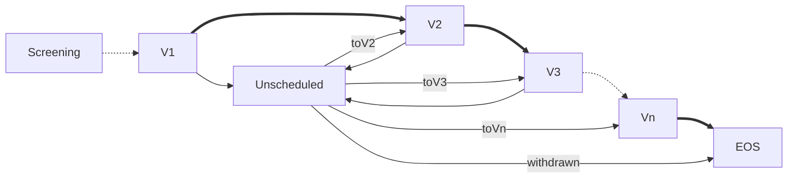

#### Unscheduled Visits

The possibility exists in any clincal trial that a research participant cannot or does not only follow the defined study schedule. These **unscheduled visits** may be recognised and fully defined in the protocol, or may be left undefined and in the hands of the study team to define during study set up. If specified, the protocol detail the procedures and assessments that should be performed if such a visit becomes necessary

Defined **unscheduled visits** will be encounters that are not part of the per-protocol schedule of activities. Standard **unscheduled activities** will usually include reviews of adverse events and concomitant medication (for the proper management and safety of a study participant), and any appropriate study specific activities.

These visits will typically be triggered by emergent events such as the occurrence of an adverse event (AE) that requires medical evaluation, or participant problems such as missing a planned visit. Other triggers can include a clinical need to follow up on abnormal laboratory results, the initiation of a new concomitant medication, or other intercurrent events that could impact the study's integrity or the participant's well-being. The timing of these visits is, by definition, not planned, and they will be used repeatably as required. It is not umcommon to find that many of an **unscheduled visits**  **unscheduled activities** may be conditional (i.e., based on patient needs or investigator clinical discretion).

From an implementation perspective, unscheduled visits are not necessarily represented as pre-defined visits within a study's primary `PlanDefinition`. In IG Version 1 **unscheduled visits** can be specified using the *StudyVisitSoa* and *PlannedStudyVisitSoa* profiles, but not with integration in the primary study schedule.

Within a FHIR-Enabled EHR it would be expected that **unscheduled visits** would be instantiated as `Encounter` resources at the time they occur based on a conditional trigger as discussed above, associated with the appropriate reasons for the visit, using for example, the `Encounter.reasonCode` or `Encounter.reasonReference` elements, which can in their turn be linked to specific `AdverseEvent`, `Observation`, or `Condition` resources. This linkage provides the necessary context for the data collected during the visit, distinguishing it from data gathered during routine, scheduled encounters and allowing for proper analysis. Existing FHIR resources and semantics can be used include the`action

Within a FHIR-Enabled EHR it would be expected that **unscheduled visits** would be instantiated as `Encounter` resources at the time they occur based on a conditional trigger as discussed above. The `Encounter` can then be associated with the appropriate reasons for the visit, using, for example, the `Encounter.reasonCode` or `Encounter.reasonReference` elements, which in turn can be linked to specific `AdverseEvent`, `Observation`, or `Condition` resources. This linkage provides the necessary context for the data collected during the visit, distinguishing it from data gathered during routine, scheduled encounters and allowing for proper analysis. Existing FHIR resources and semantics can be used include the`action` `trigger` attribute that allows an action to be associated based on some event.

---

##### IG Version 1

The following FSH example shows how this is proposed to be used to specify the activities required for a suspected AE detected between planned visits.

```fsh
Instance: StudyPlan
InstanceOf: StudyProtocolSoa
Usage: #example
* title = "Study Plan"
* action[+]
  * id = "Screening"
* action[+]
  * id = "UnscheduledStudyVisitSuspectedAE"
  * definition = "StudyVisitSoa UnscheduledStudyVisitSuspectedAE"
  * trigger[+]
    * type = #named-event
    * name = "Suspected AE"
    * data

Instance: UnscheduledStudyVisitSuspectedAE
InstanceOf: StudyVisitSoa
Usage: #example
* action[+]
  * id = "Record-Visit-Date"
* action[+]
  * id = "Review-AE"
  * condition[+]
    * kind
```

---

##### IG Version 2

**IG Version 2** implements an alternative method for recognising and managing **unscheduled visits** that can be specified within (or as extensions to) a primary schedule. This offers the possibility of specifying formally when *recognised* **unscheduled visits** are expected to occur, and more importantly, offers routes back, or to, other scheduled timepoints depending upon the event or the participant condition that has initiated the visit.  

Assuming the **unscheduled visit** is defined once only (diagram), this then requires three `PlanDefinition` elements be in place:

- a defined path or paths to the **unscheduled visit**
- defined paths from the **unscheduled visit** to next visit 
- conditions on each path to control if that path is available to be followed

A set of typical paths to and from an **unscheduled visit** is shown in the diagram below. This shows that **unscheduled visits** may occur after V1 and from each subsequent scheduled visit. Following an **unscheduled visit** the subject is expected to either (a) return to following the primary schedule, or is withdrawn from the study (EOS - EndOfStudy) 



This figure accurately describes all paths to and from the **unscheduled visit**, but it is not the case that once instantiated all these paths should be available. For example, if V2 has already occured, returning to V2 is not appropriate; the next visit should either be V3 (next scheduled visit) or EOS (participant withdrawn).  

By defining conditions on each of the **FROM** paths for visit **Unscheduled** the implied behaviour can be explicity specified. This can be achieved as follows:

- condition on edge [Unscheduled to EOS]  `if WITHDRAWN true`
- condition on edge [Unscheduled to V2] `if EXISTS [SCREENING, V1,V2] if NOT EXISTS [V3, Vn.., EOS]`
- condition on edge [Unscheduled to V3] `if EXISTS [SCREENING, V1,V2,V3] if NOT EXISTS [Vn.., EOS]`
- condition on edge [Unscheduled to Vn..] `if EXISTS [SCREENING, V1,V2,V3,Vn] if NOT EXISTS [Vn+1.., EOS]`

*PlanDefinition* FSH snippet below shows how the **unscheduled visit** options and conditions can be represented fully and accurately for visit **Unscheduled** using the **IG Version 2** `SOATimePoint` and `SOATransition` extensions.

[FSH...]

[...FSH]

