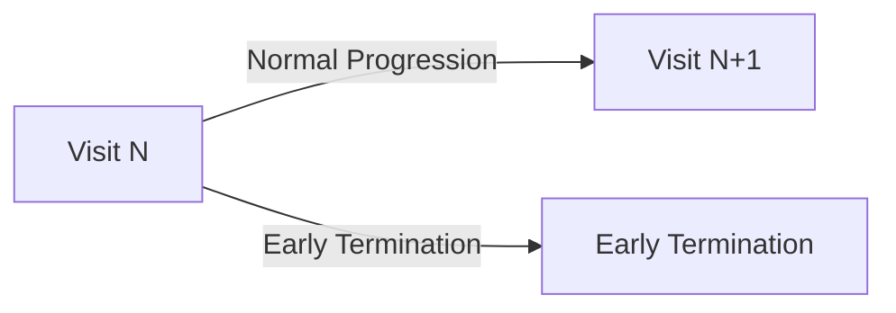

#### Dynamic Visit Schedules
One of the factors influencing the move towards more complex study designs is the escalating cost of conducting clinical research. As drug development becomes more expensive, sponsors are increasingly motivated to maximize the scientific and commercial value from each study. This has led to a shift away from traditional, linear study designs towards more intricate protocols that can answer multiple questions simultaneously, evaluate several treatments, or study various patient populations within a single trial framework.

This drive for efficiency has given rise to adaptive designs and master protocols, such as platform, basket, and umbrella trials. These modern approaches often incorporate conditional logic, where the study path for a participant can change based on interim results, biomarker status, or other criteria. Consequently, the schedule of activities is no longer a static table but a dynamic plan with branching pathways and conditional events. While these designs can accelerate drug development and reduce overall costs, they introduce significant complexity in defining, implementing, and managing the schedule of activities across different systems.

The goal of the IG will be to be able to define **enough** semantics to represent the encounters, activities and transitions between them.  The FHIR Workflow pattern is useful for defining the structural layout for the encounters and activities; defining how the workflow is applied requires the use of an application layer.  

The execution of the plan would need to be able to be adapted to describe what transitions could occur (under what conditions); examples of the types of transitions:
* Patients in different cohorts undergo different activities
* If the patient is a participant in an oncology study and the intervention is not showing therapeutic benefit (as ascertained by Disease Response Assessment/RECIST) then the patient should transition to End of Treatment and Follow-up
* If the patient passes away.

Discussions:
* For something complex (eg Sanofi Platform Trial) 
  * do we have a PlanDefinition per 'Cohort'; 
    * remove the instance level conditionality
  * 
