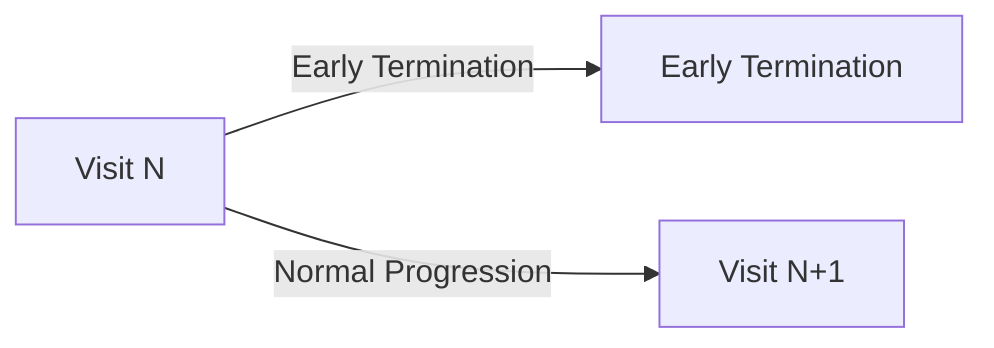
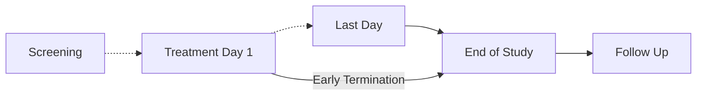
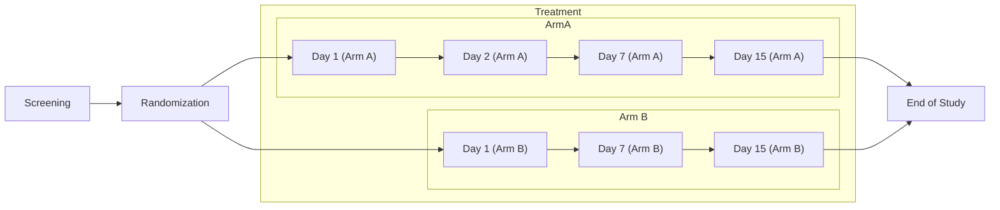
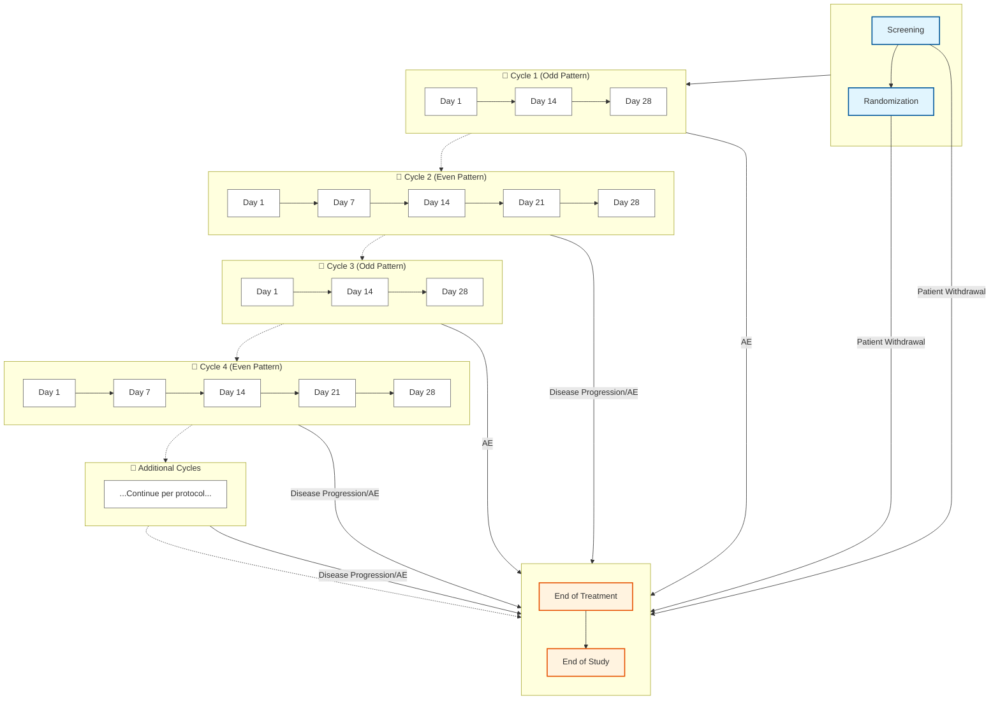

#### Dynamic Visit Schedules

One of the factors influencing the move towards more complex study designs is the escalating cost of conducting clinical research. As drug development becomes more expensive, sponsors are increasingly motivated to maximize the scientific and commercial value from each study. This has led to a shift away from traditional, linear study designs towards more intricate protocols that can answer multiple questions simultaneously, evaluate several treatments, or study various patient populations within a single trial framework.

This drive for efficiency has given rise to adaptive designs and master protocols, such as [platform](https://en.wikipedia.org/wiki/Platform_trial), [basket](https://www.cancer.gov/publications/dictionaries/cancer-terms/def/basket-trial), and [umbrella](https://www.cancer.gov/publications/dictionaries/cancer-terms/def/umbrella-trial) trials. These modern approaches often incorporate conditional logic, where the study path for a participant can change based on interim results, biomarker status, or other criteria. Consequently, the schedule of activities is no longer a static table but a dynamic plan with branching pathways and conditional events. While these designs can accelerate drug development and reduce overall costs, they introduce significant complexity in defining, implementing, and managing the schedule of activities across different systems. Additionally, under the guise of [Adaptive Trial Design](https://bmcmedicine.biomedcentral.com/articles/10.1186/s12916-018-1017-7) the implementation of the study can change significantly for a patient.

The goal of the IG will be to be able to define **enough** semantics to represent the encounters, activities and transitions between them. The FHIR Workflow pattern is useful for defining the structural layout for the encounters and activities; defining how the workflow is applied requires the use of an application layer.

##### Multiple Designs

Within the current implementation, it is possible to accommodate one or more schedules through use of the multiple entries in the `ResearchStudy.protocol` attribute based on the core `ResearchStudy` resource 

```
Instance: SampleMultiDesignStudy
InstanceOf: ResearchStudy
Usage: #example
* title = "Sample Multi Design Study"
* protocol[+] = Reference(PlanDefinition/StudyDesignA)
* protocol[+] = Reference(PlanDefinition/StudyDesignB)

Instance: StudyDesignA
InstanceOf: StudyProtocolSoa
Usage: #example
* status = #active
* title = "Study Design A"

Instance: StudyDesignB
InstanceOf: StudyProtocolSoa
Usage: #example
* status = #active
* title = "Study Design B"

```

The designer will need to determine whether there needs to be separate protocol plan element, or whether a multi-design study should just be included within a single plan and use dynamic features to switch on and off parts of the study designs.  Some examples are shown below.

For an example of a [master protocol](https://www.sciencedirect.com/science/article/pii/S2451865420300521), the existing `ResearchStudy.partOf` predicate can be used to nest the sub-studies beneath the master protocol itself, this allows for differentiation of eligibility criteria, lifecycle, etc.

##### Transitions

The modality of transitions are needed to represent a prospective plan for a ResearchSubject participating in a Clinical Trial; it supports planning and decision making. Generally, patients follow a protocol proscribed path through encounters and activities. We have previously described how activities within an encounter can be orchestrated; but this document is intended to summarise approaches for intra-encounter activities.

We have chosen to use the extensions proposed by [Richardson A, Genyn P
Clinical Trial Schedule of Activities Specification Using Fast Healthcare Interoperability Resources Definitional Resources: Mixed Methods Study JMIR Med Inform 2025;13:e71430](https://medinform.jmir.org/2025/1/e71430/PDF) - henceforth referred to as MMS.  The authors have kindly agreed for their work to be utilised as part of the IG, with the qualification that full recognition for the work shall remain theirs alone.


If we take a simple example; the progression of a patient in a study design - the following example provides an illustration



Here is a representation of this structure using the implementation details per above:
```fsh
Instance: dynamic-visit-schedule-simple-example
InstanceOf: PlanDefinition
Usage: #example
* meta.versionId = "0"
* meta.lastUpdated = "2025-11-09T15:13:31Z"
* identifier.system = "http://www.fhir4pharma.com/plandefinition"
* identifier.value = "5c2a9671-1d0d-4b02-8f09-0e30d77411b2"
* version = "V00"
* name = "dynamic-visit-schedule-simple-example"
* title = "dynamic-visit-schedule-simple-example"
* type = $plan-definition-type#clinical-protocol
* status = #active
* publisher = "fhir4pharma [Richardson & Genyn, JMIR Med Inform 2025;13:e71430, DOI: 10.2196/71430]"
* description = "dynamic-visit-schedule-simple-example"
* action[0]
  * id = "ac4d0cb9-f2bd-49c1-8b28-42d5cd04b4fb"
  * extension.extension[+]
    * url = "soaPlannedTimePoint"
    * valueQuantity = 0 's'
  * extension.extension[+]
    * url = "soaReferenceTimePoint"
    * valueString = "Visit N"
  * extension.extension[+]
    * url = "soaRepeatAllowed"
    * valueBoolean = false
  * extension.extension[+]
    * url = "soaPlannedDuration"
    * valueDuration = 24 'h'
  * extension.extension[+]
    * url = "soaTimePointType"
    * valueString = "Interaction"
  * extension.extension[+]
    * url = "soaPlannedRange"
    * valueRange.low = 0 's'
    * valueRange.high = 0 's'
  * extension.extension[+]
    * url = "soaRangeFromTimePoint"
    * valueString = "Visit N"
  * extension.extension
    * url = "http://fhir4pharma.com/StructureDefinition/soaPlannedTimepoint"
  * title = "Visit N"
  * description = "Visit N"
  * groupingBehavior = #visual-group
  * selectionBehavior = #exactly-one
  * definitionCanonical = "http://example.org/Encounter/Visit-N"
* action[+]
  * extension
    * url = "http://fhir4pharma.com/StructureDefinition/soaTransition"
    * extension[+]
      * url = "soaTargetId"
      * valueString = "c25995f4-be76-47fa-ae90-a46100f8cfb3"
    * extension[+]
      * url = "soaTransitionType"
      * valueString = "SS"
    * extension[+]
      * url = "soaTransitionDelay"
      * valueDuration = 14 'd'
    * extension[+]
      * url = "soaTransitionRange"
      * valueRange
        * low = 0 's'
        * high = 0 's'
    * condition
      * kind = #start
      * expression
        * language = #text/x-soa-expressionplain
        * expression = "{'toNormalProgression':true}"
  * action[+]
    * extension
      * url = "http://fhir4pharma.com/StructureDefinition/soaTransition"
      * extension[+]
        * url = "soaTargetId"
        * valueString = "349447c3-8ad4-4034-8c31-c3d96dcc5f9a"
      * extension[+]
        * url = "soaTransitionType"
        * valueString = "SS"
      * extension[+]
        * url = "soaTransitionDelay"
        * valueDuration = 24 'h'
      * extension[+]
        * url = "soaTransitionRange"
        * valueRange
          * low = 0 's'
          * high = 0 's'
    * condition
      * kind = #start
      * expression
        * language = #text/x-soa-expressionplain
        * expression
          * expression = "{'toEarlyTermination':true}"
* action[+]
  * id = "c25995f4-be76-47fa-ae90-a46100f8cfb3"
  * extension
    * url = "http://fhir4pharma.com/StructureDefinition/soaPlannedTimepoint"
    * extension[0]
      * url = "soaPlannedTimePoint"
      * valueQuantity = 14 'd'
    * extension[+]
      * url = "soaReferenceTimePoint"
      * valueString = "Visit N"
    * extension[+]
      * url = "soaRepeatAllowed"
      * valueBoolean = false
    * extension[+]
      * url = "soaPlannedDuration"
      * valueDuration = 24 'h'
    * extension[+]
      * url = "soaTimePointType"
      * valueString = "Interaction"
    * extension[+]
      * url = "soaPlannedRange"
      * valueRange
        * low = 24 'h'
        * high = 24 'h'
    * extension[+]
      * url = "soaRangeFromTimePoint"
      * valueString = "Visit N"
  * title = "Visit N+1"
  * description = "Visit N+1"
  * definitionCanonical = "http://example.org/Encounter/Visit-N+1"
* action[+]
  * id = "349447c3-8ad4-4034-8c31-c3d96dcc5f9a"
  * title = "Early Termination"
  * description = "Early Termination"
  * definitionCanonical = "http://example.org/Encounter/Early-Termination"
  * extension
    * url = "http://fhir4pharma.com/StructureDefinition/soaPlannedTimepoint"
    * extension[+]
      * url = "soaPlannedTimePoint"
      * valueQuantity = 24 'h'
    * extension[+]
      * url = "soaReferenceTimePoint"
      * valueString = "Visit N"
    * extension[+]
      * url = "soaRepeatAllowed"
      * valueBoolean = false
    * extension[+]
      * url = "soaPlannedDuration"
      * valueDuration = 24 'h'
    * extension[+]
      * url = "soaTimePointType"
      * valueString = "Interaction"
    * extension[+]
      * url = "soaPlannedRange"
      * valueRange
        * low = 0 's'
        * high = 14 'd'
    * extension[+]
      * url = "soaRangeFromTimePoint"
      * valueString = "Visit N"
```
The Patient will progress from one encounter to the next based on directives and conditions in the protocol; the conditions can be driven by endogenous (eg patient responses/data/study design) or exogenous factors (eg randomization, sponsor decision).  Providing Decision Support for these systems requires a design that can represent the different factors and outcomes.

The designs should incorporate these directives in such a way that an application could interpret them to make decisions about the transitions; and thereby create the required resources (eg Encounter, Appointment, ServiceRequest). The challenge we have is that in CTMS systems, that are built around common conceptual understandings of how clinical trials work, the functions to drive these transitions are out of the box, whereas finding a common representation using FHIR resources may be challenging.


Many of these activities can be intuited from the `ResearchSubject.status` attribute; so if there are suitable systems that can update that status then the plan should work. As an example; in the case of patient being lost to follow-up the site coordinator/designated patient management system could update the ResearchSubject.status to be *withdrawn*.

The execution of the plan needs to be able to be adapted to describe what transitions could occur and describe any conditions under which the transitions might occur; examples of the types of transitions that could need to be represented:

- Patient populations in different cohorts undergo different activities based on their cohort
- Normal per protocol transition from treatment encounter to encounter.
- Patient discontinuing study based on outcomes
- Patient lost to follow-up
- If the patient is a participant in an oncology study and the intervention is not showing therapeutic benefit (eg as ascertained by a Disease Response Assessment/RECIST) then the patient should transition to End of Treatment and Follow-up
- Sponsors may choose to close a study based on pre-defined characteristics detailed in the protocol (eg Six months after the last patient in)

So, what needs to be defined for a given encounter forward in patient progression based on what activities are planned to occur next based on the protocol; some are common such as the Early Termination path; based on outcomes from the study (eg Serious Adverse Event, Lost to Follow-up), others can be be more complicated.


First, we illustrate the use of the Exit to represent the paths in the following diagram (following a single schedule):



Here is the representation using the design above:
```fsh
Instance: dynamic-visit-schedule-exit-example
InstanceOf: PlanDefinition
Usage: #example
* meta
  * versionId = "0"
  * lastUpdated = "2025-11-11T18:30:41Z"
* identifier
  * system = "http://www.fhir4pharma.com/plandefinition"
  * value = "6edf3bcf-d2d9-4f47-a0f4-4efe9c9cb265"
* version = "V00"
* name = "dynamic-visit-schedule-simple-example"
* title = "dynamic-visit-schedule-simple-example"
* status = #active
* publisher = "fhir4pharma [Richardson & Genyn, JMIR Med Inform 2025;13:e71430, DOI: 10.2196/71430]"
* description = "dynamic-visit-schedule-simple-example"
* action[0]
  * id = "349447c3-8ad4-4034-8c31-c3d96dcc5f9a"
  * extension
    * extension[0]
      * url = "soaPlannedTimePoint"
      * valueQuantity = 24 'h'
    * extension[+]
      * url = "soaReferenceTimePoint"
      * valueString = "Treatment Day 1"
    * extension[+]
      * url = "soaRepeatAllowed"
      * valueBoolean = false
    * extension[+]
      * url = "soaPlannedDuration"
      * valueDuration = 24 'h'
    * extension[+]
      * url = "soaTimePointType"
      * valueString = "Interaction"
    * extension[+]
      * url = "soaPlannedRange"
      * valueRange
        * low = 0 's'
        * high = 14 'd'
    * extension[+]
      * url = "soaRangeFromTimePoint"
      * valueString = "Treatment Day 1"
    * url = "http://fhir4pharma.com/StructureDefinition/soaPlannedTimepoint"
  * title = "Early Termination"
  * description = "Early Termination"
  * groupingBehavior = #visual-group
  * selectionBehavior = #exactly-one
  * definitionCanonical = "http://example.org/Encounter/Early-Termination"
  * action.extension
    * extension[0]
      * url = "soaTargetId"
      * valueString = "dbc35dee-a5f2-473f-b9b1-bb14b2a1c9ef"
    * extension[+]
      * url = "soaTransitionType"
      * valueString = "SS"
    * extension[+]
      * url = "soaTransitionDelay"
      * valueDuration = 24 'h'
    * extension[+]
      * url = "soaTransitionRange"
      * valueRange
        * low = 0 's'
        * high = 0 's'
    * url = "http://fhir4pharma.com/StructureDefinition/soaTransition"
* action[+]
  * id = "d0dd287a-0a87-439d-95cc-8690e7abf0cb"
  * extension
    * extension[0]
      * url = "soaPlannedTimePoint"
      * valueQuantity = 28 'd'
    * extension[+]
      * url = "soaReferenceTimePoint"
      * valueString = "Treatment Day 1"
    * extension[+]
      * url = "soaRepeatAllowed"
      * valueBoolean = false
    * extension[+]
      * url = "soaPlannedDuration"
      * valueDuration = 24 'h'
    * extension[+]
      * url = "soaTimePointType"
      * valueString = "Interaction"
    * extension[+]
      * url = "soaPlannedRange"
      * valueRange
        * low = 24 'h'
        * high = 24 'h'
    * extension[+]
      * url = "soaRangeFromTimePoint"
      * valueString = "Treatment Day 1"
    * url = "http://fhir4pharma.com/StructureDefinition/soaPlannedTimepoint"
  * title = "Last Day"
  * description = "Last Day"
  * groupingBehavior = #visual-group
  * selectionBehavior = #exactly-one
  * definitionCanonical = "http://example.org/Encounter/Last-Day"
  * action.extension
    * extension[0]
      * url = "soaTargetId"
      * valueString = "dbc35dee-a5f2-473f-b9b1-bb14b2a1c9ef"
    * extension[+]
      * url = "soaTransitionType"
      * valueString = "SS"
    * extension[+]
      * url = "soaTransitionDelay"
      * valueDuration = 7 'd'
    * extension[+]
      * url = "soaTransitionRange"
      * valueRange
        * low = 0 's'
        * high = 0 's'
    * url = "http://fhir4pharma.com/StructureDefinition/soaTransition"
* action[+]
  * id = "a1806239-54f3-4762-af3f-edb9d80d29dc"
  * extension
    * extension[0]
      * url = "soaPlannedTimePoint"
      * valueQuantity = 0 's'
    * extension[+]
      * url = "soaReferenceTimePoint"
      * valueString = "Screening"
    * extension[+]
      * url = "soaRepeatAllowed"
      * valueBoolean = false
    * extension[+]
      * url = "soaPlannedDuration"
      * valueDuration = 24 'h'
    * extension[+]
      * url = "soaTimePointType"
      * valueString = "Interaction"
    * extension[+]
      * url = "soaPlannedRange"
      * valueRange
        * low = 24 'h'
        * high = 24 'h'
    * extension[+]
      * url = "soaRangeFromTimePoint"
      * valueString = "Screening"
    * url = "http://fhir4pharma.com/StructureDefinition/soaPlannedTimepoint"
  * title = "Treatment Day 1"
  * description = "Treatment Day 1"
  * groupingBehavior = #visual-group
  * selectionBehavior = #exactly-one
  * definitionCanonical = "http://example.org/Encounter/Treatment-Day-1"
  * action[0].extension
    * extension[0]
      * url = "soaTargetId"
      * valueString = "349447c3-8ad4-4034-8c31-c3d96dcc5f9a"
    * extension[+]
      * url = "soaTransitionType"
      * valueString = "SS"
    * extension[+]
      * url = "soaTransitionDelay"
      * valueDuration = 24 'h'
    * extension[+]
      * url = "soaTransitionRange"
      * valueRange
        * low = 0 's'
        * high = 0 's'
    * url = "http://fhir4pharma.com/StructureDefinition/soaTransition"
  * action[+].extension
    * extension[0]
      * url = "soaTargetId"
      * valueString = "d0dd287a-0a87-439d-95cc-8690e7abf0cb"
    * extension[+]
      * url = "soaTransitionType"
      * valueString = "SS"
    * extension[+]
      * url = "soaTransitionDelay"
      * valueDuration = 28 'd'
    * extension[+]
      * url = "soaTransitionRange"
      * valueRange
        * low = 0 's'
        * high = 0 's'
    * url = "http://fhir4pharma.com/StructureDefinition/soaTransition"
* action[+]
  * id = "dbc35dee-a5f2-473f-b9b1-bb14b2a1c9ef"
  * extension
    * extension[0]
      * url = "soaPlannedTimePoint"
      * valueQuantity = 7 'd'
    * extension[+]
      * url = "soaReferenceTimePoint"
      * valueString = "Last Day"
    * extension[+]
      * url = "soaRepeatAllowed"
      * valueBoolean = false
    * extension[+]
      * url = "soaPlannedDuration"
      * valueDuration = 24 'h'
    * extension[+]
      * url = "soaTimePointType"
      * valueString = "Interaction"
    * extension[+]
      * url = "soaPlannedRange"
      * valueRange
        * low = 24 'h'
        * high = 24 'h'
    * extension[+]
      * url = "soaRangeFromTimePoint"
      * valueString = "Last Day"
    * url = "http://fhir4pharma.com/StructureDefinition/soaPlannedTimepoint"
  * title = "End of Study"
  * description = "End of Study"
  * groupingBehavior = #visual-group
  * selectionBehavior = #exactly-one
  * definitionCanonical = "http://example.org/Encounter/End-of-Study"
  * action.extension
    * extension[0]
      * url = "soaTargetId"
      * valueString = "76fb46ca-2a08-4421-8ce9-b8d412db2fb5"
    * extension[+]
      * url = "soaTransitionType"
      * valueString = "SS"
    * extension[+]
      * url = "soaTransitionDelay"
      * valueDuration = 28 'd'
    * extension[+]
      * url = "soaTransitionRange"
      * valueRange
        * low = 0 's'
        * high = 0 's'
    * url = "http://fhir4pharma.com/StructureDefinition/soaTransition"
* action[+]
  * id = "0700e721-1f12-4998-89b8-6f4e649b62f7"
  * extension
    * extension[0]
      * url = "soaPlannedTimePoint"
      * valueQuantity = 0 's'
    * extension[+]
      * url = "soaReferenceTimePoint"
      * valueString = "Screening"
    * extension[+]
      * url = "soaRepeatAllowed"
      * valueBoolean = false
    * extension[+]
      * url = "soaPlannedDuration"
      * valueDuration = 24 'h'
    * extension[+]
      * url = "soaTimePointType"
      * valueString = "Interaction"
    * extension[+]
      * url = "soaPlannedRange"
      * valueRange
        * low = 24 'h'
        * high = 24 'h'
    * extension[+]
      * url = "soaRangeFromTimePoint"
      * valueString = "Screening"
    * url = "http://fhir4pharma.com/StructureDefinition/soaPlannedTimepoint"
  * title = "Screening"
  * description = "Screening"
  * groupingBehavior = #visual-group
  * selectionBehavior = #exactly-one
  * definitionCanonical = "http://example.org/Encounter/Screening"
  * action.extension
    * extension[0]
      * url = "soaTargetId"
      * valueString = "a1806239-54f3-4762-af3f-edb9d80d29dc"
    * extension[+]
      * url = "soaTransitionType"
      * valueString = "SS"
    * extension[+]
      * url = "soaTransitionDelay"
      * valueDuration = 0 's'
    * extension[+]
      * url = "soaTransitionRange"
      * valueRange
        * low = 0 's'
        * high = 0 's'
    * url = "http://fhir4pharma.com/StructureDefinition/soaTransition"
* action[+]
  * id = "76fb46ca-2a08-4421-8ce9-b8d412db2fb5"
  * extension
    * extension[0]
      * url = "soaPlannedTimePoint"
      * valueQuantity = 28 'd'
    * extension[+]
      * url = "soaReferenceTimePoint"
      * valueString = "End of Study"
    * extension[+]
      * url = "soaRepeatAllowed"
      * valueBoolean = false
    * extension[+]
      * url = "soaPlannedDuration"
      * valueDuration = 24 'h'
    * extension[+]
      * url = "soaTimePointType"
      * valueString = "Interaction"
    * extension[+]
      * url = "soaPlannedRange"
      * valueRange
        * low = 24 'h'
        * high = 24 'h'
    * extension[+]
      * url = "soaRangeFromTimePoint"
      * valueString = "End of Study"
    * url = "http://fhir4pharma.com/StructureDefinition/soaPlannedTimepoint"
  * title = "Follow Up"
  * description = "Follow Up"
  * definitionCanonical = "http://example.org/Encounter/Follow-Up"
  
Instance: StudyVisit01
InstanceOf: SoAVisitPlan
Usage: #example
* status = #active
* action[+]
  * definitionCanonical = "ActivityDefinition/ScreeningVitals"

Instance: StudyVisit02Baseline
InstanceOf: SoAVisitPlan
Usage: #example
* status = #active
* action[+]
  * definitionCanonical = "ActivityDefinition/Vitals"
* action[+]
  * definitionCanonical = "ActivityDefinition/Randomization"

Instance: StudyVisit03Day1
InstanceOf: SoAVisitPlan
Usage: #example
* status = #active
* action[+]
  * definitionCanonical = "ActivityDefinition/Vitals"

Instance: StudyVisit04Day15
InstanceOf: SoAVisitPlan
Usage: #example
* status = #active
* action[+]
  * definitionCanonical = "ActivityDefinition/Vitals"

Instance: StudyVisitEoS
InstanceOf: SoAVisitPlan
Usage: #example
* status = #active
* action[+]
  * definitionCanonical = "ActivityDefinition/Vitals"

Instance: StudyVisitFollowUp
InstanceOf: SoAVisitPlan
Usage: #example
* status = #active
* action[+]
  * definitionCanonical = "ActivityDefinition/Vitals"
```

In the following example we represent the case where there are multiple paths depending on a classification



The representation of this is shown here

```fsh
Instance: Multi-Arm-Design
InstanceOf: StudyProtocolSoa
Title: "Multi-path based on Arm"
Usage: #example 
* status = #active


Instance: Screening
InstanceOf: SoAVisitPlan
Title: "Screening"
Usage: #example
* status = #active

Instance: Baseline
InstanceOf: SoAVisitPlan
Title: "Baseline/Randomisation"
Usage: #example
* status = #active


Instance: TreatmentDay1ArmA
InstanceOf: SoAVisitPlan
Title: "Day 1"
Usage: #example
* status = #active
* action[+]
  * definitionCanonical

Instance: TreatmentDay2ArmA
InstanceOf: SoAVisitPlan
Title: "Day 2"
Usage: #example
* status = #active

Instance: TreatmentDay7ArmA
InstanceOf: SoAVisitPlan
Title: "Day 7"
Usage: #example
* status = #active

Instance: TreatmentDay15ArmA
InstanceOf: SoAVisitPlan
Title: "Day 15"
Usage: #example
* status = #active

Instance: TreatmentDay1ArmB
InstanceOf: SoAVisitPlan
Title: "Day 1"
Usage: #example
* status = #active

Instance: TreatmentDay7ArmB
InstanceOf: SoAVisitPlan
Title: "Day 7"
Usage: #example
* status = #active

Instance: TreatmentDay15ArmB
InstanceOf: SoAVisitPlan
Title: "Day 15"
Usage: #example
* status = #active

Instance: EndOfStudy
InstanceOf: SoAVisitPlan
Title: "End of Study"
Usage: #example
* status = #active

```

##### Treatment Cycles

One of the more complex scenarios we need to deal with are [treatment cycles](https://www.cancer.gov/publications/dictionaries/cancer-terms/def/treatment-cycle); these are repeatable episodic sets of encounters, usually in oncology studies. The structure of cycles may change over the progression of the studies; different encounters or activities occur based on the protocol. The status of the patient is evaluated at the end of each cycle, usually against a standard criteria like RECIST. The progression of the disease is the key determinant to whether the patient will continue to stay in the study (alongside all other safety measures discussed).


Some examples of Oncology Cycles:

- 3-Week Cycle (e.g., 1-5-9 Schedule)
  - Treatment Period: A patient receives chemotherapy on days 1, 5, and 9.
  - Rest Period: Days 10 through 21 are a rest period.
  - Cycle Length: The entire period, from the start of treatment to the beginning of the next, lasts 21 days.
- 28-Day Cycle (e.g., Lonsurf®)
  - Treatment Period: The drug Trifluridine-tipiracil hydrochloride is taken as a tablet twice a day.
  - Rest Period: A 28-day period encompasses the full cycle of treatment.
- Weekly Treatment with a Rest Period
  - Treatment Period: A single dose of chemotherapy might be given once a week.
  - Rest Period: The remaining days of the week, or several weeks, are spent in rest.
  - Example: A week of daily chemotherapy followed by three weeks of no treatment constitutes one 4-week cycle.

The following illustrates a typical oncology study design with repeating treatment cycles that have different visit patterns for even and odd cycles. The diagram shows cycles as distinct entities with clear transitions between cycles and within cycles:

|  | **Screening** |  | **Cycle 1 (Odd)** |  |  | **Cycle 2 (Even)** |  |  |  |  | **Cycle 3 (Odd)** |  |  | **Cycle 4 (Even)** |  |  |  |  | **...** | **End of Treatment** | **Follow-up** |  |
|--|:--:|:--:|:--:|:--:|:--:|:--:|:--:|:--:|:--:|:--:|:--:|:--:|:--:|:--:|:--:|:--:|:--:|:--:|:--:|:--:|:--:|:--:|
| **Visit** | **Screen** | **Rand** | **C1D1** | **C1D14** | **C1D28** | **C2D1** | **C2D7** | **C2D14** | **C2D21** | **C2D28** | **C3D1** | **C3D14** | **C3D28** | **C4D1** | **C4D7** | **C4D14** | **C4D21** | **C4D28** | **...** | **EOT** | **FU1** | **FU2** |
| **Study Day** | -28 to -1 | 0 | 1 | 14 | 28 | 29 | 35 | 42 | 49 | 56 | 57 | 70 | 84 | 85 | 91 | 98 | 105 | 112 | ... | +30 | +90 | +180 |
| **Window** | ±7d |  | ±2d | ±2d | ±2d | ±2d | ±2d | ±2d | ±2d | ±2d | ±2d | ±2d | ±2d | ±2d | ±2d | ±2d | ±2d | ±2d | ±2d | ±7d | ±14d | ±14d |
| **Activities** |  |  |  |  |  |  |  |  |  |  |  |  |  |  |  |  |  |  |  |  |  |  |
| Informed Consent | ✓ |  |  |  |  |  |  |  |  |  |  |  |  |  |  |  |  |  |  |  |  |  |
| Demographics | ✓ |  |  |  |  |  |  |  |  |  |  |  |  |  |  |  |  |  |  |  |  |  |
| Medical History | ✓ |  |  |  |  |  |  |  |  |  |  |  |  |  |  |  |  |  |  |  |  |  |
| Physical Exam | ✓ | ✓ | ✓ | ✓ | ✓ | ✓ |  | ✓ | ✓ | ✓ | ✓ | ✓ | ✓ | ✓ |  | ✓ | ✓ | ✓ | ✓ | ✓ | ✓ | ✓ |
| Vital Signs | ✓ | ✓ | ✓ | ✓ | ✓ | ✓ | ✓ | ✓ | ✓ | ✓ | ✓ | ✓ | ✓ | ✓ | ✓ | ✓ | ✓ | ✓ | ✓ | ✓ | ✓ | ✓ |
| Height/Weight | ✓ |  |  |  | ✓ |  |  |  |  | ✓ |  |  | ✓ |  |  |  |  | ✓ | ✓ | ✓ |  |  |
| Performance Status | ✓ | ✓ | ✓ |  | ✓ | ✓ |  |  |  | ✓ | ✓ |  | ✓ | ✓ |  |  |  | ✓ | ✓ | ✓ | ✓ | ✓ |
| **Laboratory Tests** |  |  |  |  |  |  |  |  |  |  |  |  |  |  |  |  |  |  |  |  |  |  |
| Hematology | ✓ | ✓ | ✓ | ✓ | ✓ | ✓ | ✓ | ✓ | ✓ | ✓ | ✓ | ✓ | ✓ | ✓ | ✓ | ✓ | ✓ | ✓ | ✓ | ✓ | ✓ | ✓ |
| Chemistry Panel | ✓ | ✓ | ✓ | ✓ | ✓ | ✓ | ✓ | ✓ | ✓ | ✓ | ✓ | ✓ | ✓ | ✓ | ✓ | ✓ | ✓ | ✓ | ✓ | ✓ | ✓ | ✓ |
| Liver Function | ✓ | ✓ | ✓ | ✓ | ✓ | ✓ | ✓ | ✓ | ✓ | ✓ | ✓ | ✓ | ✓ | ✓ | ✓ | ✓ | ✓ | ✓ | ✓ | ✓ | ✓ |  |
| Coagulation | ✓ |  | ✓ |  | ✓ | ✓ |  |  |  |  | ✓ |  | ✓ | ✓ |  |  |  |  | ✓ | ✓ |  |  |
| Biomarkers | ✓ |  | ✓ |  | ✓ | ✓ |  |  |  | ✓ | ✓ |  | ✓ | ✓ |  |  |  | ✓ | ✓ | ✓ | ✓ | ✓ |
| **Treatment** |  |  |  |  |  |  |  |  |  |  |  |  |  |  |  |  |  |  |  |  |  |  |
| Study Drug Admin |  |  | ✓ |  |  | ✓ |  |  |  |  | ✓ |  |  | ✓ |  |  |  |  | ✓ |  |  |  |
| Pre-medication |  |  | ✓ |  |  | ✓ |  |  |  |  | ✓ |  |  | ✓ |  |  |  |  | ✓ |  |  |  |
| **Imaging** |  |  |  |  |  |  |  |  |  |  |  |  |  |  |  |  |  |  |  |  |  |  |
| CT/MRI Scan | ✓ |  |  |  | ✓ |  |  |  |  | ✓ |  |  | ✓ |  |  |  |  | ✓ | ✓ | ✓ | ✓ | ✓ |
| Chest X-ray | ✓ |  |  |  |  |  |  |  |  |  |  |  |  |  |  |  |  |  | ✓ |  |  | ✓ |
| Disease Response | ✓ |  |  |  |  |  |  |  |  | ✓ |  |  |  |  |  |  |  | ✓ | ✓ | ✓ | ✓ | ✓ |
| **Assessments** |  |  |  |  |  |  |  |  |  |  |  |  |  |  |  |  |  |  |  |  |  |  |
| Quality of Life | ✓ |  | ✓ |  | ✓ |  |  |  |  | ✓ |  |  | ✓ |  |  |  |  | ✓ | ✓ | ✓ | ✓ | ✓ |
| Adverse Events | ✓ | ✓ | ✓ | ✓ | ✓ | ✓ | ✓ | ✓ | ✓ | ✓ | ✓ | ✓ | ✓ | ✓ | ✓ | ✓ | ✓ | ✓ | ✓ | ✓ | ✓ | ✓ |
| Concomitant Meds | ✓ | ✓ | ✓ | ✓ | ✓ | ✓ | ✓ | ✓ | ✓ | ✓ | ✓ | ✓ | ✓ | ✓ | ✓ | ✓ | ✓ | ✓ | ✓ | ✓ | ✓ | ✓ |

This can be illustrated graphically as follows:



```fsh
Instance: StudyPlan
InstanceOf: StudyProtocolSoa
Title: "Study Plan"
* status = #active
* actions[+]
  * definitionCanonical = "PlanDefinition/Screening"
  * extensions[+]
    * extension
      * url = XXXX
* actions[+]
  * definitionCanonical = "PlanDefinition/Baseline"
* actions[+]
  * definitionCanonical = "PlanDefinition/Cycle1"
* actions[+]
  * definitionCanonical = "PlanDefinition/CycleEven"
* actions[+]
  * definitionCanonical = "PlanDefinition/CycleOdd"
* actions[+]
  * definitionCanonical = "PlanDefinition/EndOfTreatment"

Instance: Screening
InstanceOf: PlanDefinition
Title: "Screening"
Usage: #example
* status = #active
* action[+]
  * definitionCanonical = ActivityDefinition/InformedConsent
* action[+]
  * definitionCanonical = ActivityDefinition/Demographics
* action[+]
  * definitionCanonical = ActivityDefinition/MedicalHistory
* action[+]
  * definitionCanonical = ActivityDefinition/PhysicalExaminationScreening
* action[+]
  * definitionCanonical = ActivityDefinition/VitalSigns

Instance: Baseline
InstanceOf: PlanDefinition
Title: "Baseline"
Usage: #example
* status = #active


Instance: Cycle1
InstanceOf: PlanDefinition
Title: "Cycle 1"
Usage: #example
* status = #active
* actions[+]
  * definitionCanonical = "PlanDefinition/C1D1"
  * relatedAction[+] 
    * actionId = "StartOfCycle"
    * relationship = #after
    * offsetDuration = 0 'd'
    * extension[acceptableOffsetRange].valueRange.low = 1 'd'    
    * extension[acceptableOffsetRange].valueRange.high = 1 'd'    
* actions[+]
  * definitionCanonical = "PlanDefinition/C1D7"
  * relatedAction[+] 
    * actionId = "StartOfCycle"
    * relationship = #after
    * offsetDuration = 7 'd'
    * extension[acceptableOffsetRange].valueRange.low = 1 'd'    
    * extension[acceptableOffsetRange].valueRange.high = 1 'd'    
* actions[+]
  * definitionCanonical = "PlanDefinition/C1D14"
  * relatedAction[+] 
    * actionId = "StartOfCycle"
    * relationship = #after
    * offsetDuration = 14 'd'
    * extension[acceptableOffsetRange].valueRange.low = 1 'd'    
    * extension[acceptableOffsetRange].valueRange.high = 1 'd'    

Instance: CycleEven
InstanceOf: PlanDefinition
Title: "Cycle N (Odd)"
Usage: #example
* status = #active
* extension[http://hl7.org/fhir/uv/vulcan-schedule/StructureDefinition/Duration][+] = 21 'd'
* actions[+]
  * definitionCanonical = "PlanDefinition/CEvenD1"
  * relatedAction[+] 
    * actionId = "StartOfCycle"
    * relationship = #after
    * offsetDuration = 0 'd'
    * extension[acceptableOffsetRange].valueRange.low = 2 'd'    
    * extension[acceptableOffsetRange].valueRange.high = 2 'd'    
* actions[+]
  * definitionCanonical = "PlanDefinition/CEvenD7"
  * relatedAction[+] 
    * actionId = "StartOfCycle"
    * relationship = #after
    * offsetDuration = 7 'd'
    * extension[acceptableOffsetRange].valueRange.low = 2 'd'    
    * extension[acceptableOffsetRange].valueRange.high = 2 'd'    
* actions[+]
  * definitionCanonical = "PlanDefinition/CEvenD14"
  * relatedAction[+] 
    * actionId = "StartOfCycle"
    * relationship = #after
    * offsetDuration = 14 'd'
    * extension[acceptableOffsetRange].valueRange.low = 2 'd'    
    * extension[acceptableOffsetRange].valueRange.high = 2 'd'    

Instance: CycleOdd
InstanceOf: PlanDefinition
Title: "Cycle N (Odd)"
Usage: #example
* status = #active
* actions[+]
  * definitionCanonical = "PlanDefinition/COddD1"
* actions[+]
  * definitionCanonical = "PlanDefinition/COddD7"
* actions[+]
  * definitionCanonical = "PlanDefinition/COddD14"

Instance: COddD1
InstanceOf: SoAVisitPlan
Title: "Cycle N (Odd) - Day 1"
* status = #active

Instance: COddD7
InstanceOf: SoAVisitPlan
Title: "Cycle N (Odd) - Day 7"
* status = #active

Instance: COddD14
InstanceOf: SoAVisitPlan
Title: "Cycle N (Odd) - Day 14"
* status = #active

Instance: COddD28
InstanceOf: SoAVisitPlan
Title: "Cycle N (Odd) - Day 28"
* status = #active

```

##### Scratchpad

Discussions:
[Marks comment on petri nets]
In FHIR, conditions are associated with a single action, as if the transition were associated with a place rather than an arc between two places. This means a single transition rule must be duplicated and expressed as two rules: a stop rule on the first activity, and a start rule on the second activity. Furthermore, there is an implicit rule that applies to all activities in FHIR: when an activity completes, all actions listing that activity as a relatedAction are triggered (with potential time delay), unless suppressed by a start condition.
(In this discussion, I'm intentionally ignoring the fact there can be a delay between states. It doesn't matter in this analysis.)
The problem with this design is revealed when there is inward or outward branching between activities. Inward branching leads to the downstream activity having two start conditions. Outward branching from an activity leads to the source activity having two stop criteria. Repeat activities, with self-transitions, end up with the same rule as both a start and a stop rule, or with no explicit self-transition rule if expressed as a repeated activity.
According to FHIR, multiple rules of the same type “are combined using AND semantics, so the overall condition is true only if all the conditions are true.” This is simply wrong and would prevent valid transitions from happening. A partial fix would be to change the ‘AND’ to ‘OR’, thereby allowing transition to or from the state along alternative pathways when the condition for just that pathway evaluates to true.
The fundamental problem, however, is the association between conditions and actions, rather than associating those conditions with pairs of actions, i.e. arcs. This could be fixed if conditions were defined at the level of action.relatedAction, since this is where two activities are related. Currently, the only configurable aspect is a delay between the actions, with no possibility of introducing logical expression. This must change for FHIR to be able to express complex SoAs.

- For something complex (eg Sanofi Platform Trial)
  - do we have a PlanDefinition per 'Cohort';
    - remove the instance level conditionality
  -


That would lead to many of the study paths being closed down assuming progression is linked to the state being 'on-study', 'on-study-intervention' or similar. This is reliant on site staff or automation being able to update the characteristic, however processes for this already exist so could be applied to the execution of study activities. These are facile approaches, and will need to be refined (eg where there are multiple study periods, with the patient changing state between them).

Note, the criteria should never lead to a decision where there are multiple subsequent encounters without a way of determining the next encounter. In all cases, the unscheduled encounter should be available, with the expectation that the possible exits are returning to the protocol path or leaving the study.
