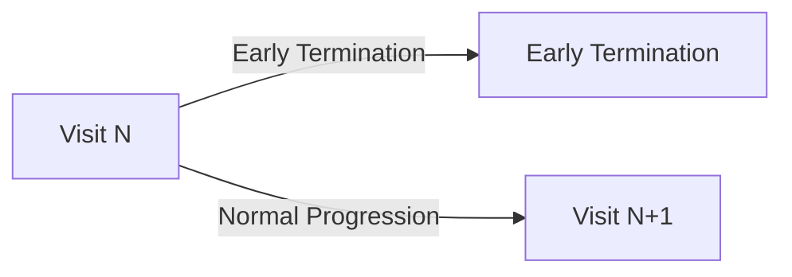

#### Dynamic Visit Schedules

One of the factors influencing the move towards more complex study designs is the escalating cost of conducting clinical research. As drug development becomes more expensive, sponsors are increasingly motivated to maximize the scientific and commercial value from each study. This has led to a shift away from traditional, linear study designs towards more intricate protocols that can answer multiple questions simultaneously, evaluate several treatments, or study various patient populations within a single trial framework.

This drive for efficiency has given rise to adaptive designs and master protocols, such as [platform](https://en.wikipedia.org/wiki/Platform_trial), [basket](https://www.cancer.gov/publications/dictionaries/cancer-terms/def/basket-trial), and [umbrella](https://www.cancer.gov/publications/dictionaries/cancer-terms/def/umbrella-trial) trials. These modern approaches often incorporate conditional logic, where the study path for a participant can change based on interim results, biomarker status, or other criteria. Consequently, the schedule of activities is no longer a static table but a dynamic plan with branching pathways and conditional events. While these designs can accelerate drug development and reduce overall costs, they introduce significant complexity in defining, implementing, and managing the schedule of activities across different systems. Additionally, under the guise of [Adaptive Trial Design](https://bmcmedicine.biomedcentral.com/articles/10.1186/s12916-018-1017-7) the implementation of the study can change significantly for a patient.

The goal of the IG will be to be able to define **enough** semantics to represent the encounters, activities and transitions between them. The FHIR Workflow pattern is useful for defining the structural layout for the encounters and activities; defining how the workflow is applied requires the use of an application layer.


##### Transitions

The modality of transitions are needed to represent a prospective plan for a ResearchSubject participating in a Clinical Trial; it supports planning and decision making.  Generally, patients follow a protocol proscribed path through encounters and activities.  We have previously described how activities within an encounter can be orchestrated; but this document is intended to summarise approaches for intra-encounter activities.

If we take a simple example; the progression of a patient in a study design - the following example provides an illustration



The Patient will progress from one encounter to the next based on directives or conditions in the protocol; the conditions can be driven by endogenous (eg patient responses/data) or exogenous factors (eg randomization, sponsor decision).  

The designs should incorporate these directives in such a way that an application could interpret them to make decisions about the transitions; and thereby create the required resources (eg Encounter, Appointment, ServiceRequest).  The challenge we have is that in CTMS systems, that are built around common conceptual understandings of how clinical trials work, the functions to drive these transitions are out of the box, whereas finding a common representation using FHIR resources may be challenging.
    
Some scenarios to consider:
* Normal progression based on allocation to an arm
* Differentiated progression based on multiple arms in a study design
* Lost to follow-up, the patient no longer responds to or attends scheduled encounters
* In-study event, a Serious Adverse Event such as death leads to the patient discontinuing participation
* Sponsors may choose to close a study based on pre-defined characteristics detailed in the protocol (eg Six months after the last patient in)

Many of these activities can be intuited from the `ResearchSubject.status` attribute; so if there are suitable systems that can update that status then the plan should work.  As an example; in the case of patient being lost to follow-up the site coordinator could update the ResearchSubject.status to be 'withdrawn'.  That would lead to many of the study paths being closed down assuming progression is linked to the state being 'on-study', 'on-study-intervention' or similar.  This is reliant on site staff or automation being able to update the characteristic, however processes for this already exist so could be applied to the execution of study activities.  These are facile approaches, and will need to be refined (eg where there are multiple study periods, with the patient changing state between them).

An example for this shown here; we define the applicability of a planned encounter based on the current `ResearchSubject.status` 
```fsh
Instance: StudyVisit01
InstanceOf: SoAVisitPlan
Usage: #example
* extension[http://hl7.org/fhir/uv/vulcan-schedule/StructureDefinition/ApplicableResearchSubjectStatus] = #screening

Instance: StudyVisit03Day1
InstanceOf: SoAVisitPlan
Usage: #example
* extension[http://hl7.org/fhir/uv/vulcan-schedule/StructureDefinition/ApplicableResearchSubjectStatus] = #on-study

Instance: StudyVisitEoS
InstanceOf: SoAVisitPlan
Usage: #example
* extension[http://hl7.org/fhir/uv/vulcan-schedule/StructureDefinition/ApplicableResearchSubjectStatus] = #withdrawn
```
This would need to be able to accommodate the different subject statuses and reflect the protocol (eg status of `#on-study`, `#on-study-intervention`, `#on-study-observation` may or may not be considered to be synonyms or not dependent on the study configuration) - the statuses should concur with the intent of the study design in the protocol and should reflect the state at the time of evaluation.  In later versions of FHIR, the patient status is much more granular; insofar as the record on the ResearchSubject has all the current and former states, and would need to be referenced for the applicable time period.

The execution of the plan needs to be able to be adapted to describe what transitions could occur and describe any conditions under which the transitions might occur; examples of the types of transitions that could need to be represented:
- Patients in different cohorts undergo different activities based on their cohort[insert diagram]
- If the patient is a participant in an oncology study and the intervention is not showing therapeutic benefit (as ascertained by Disease Response Assessment/RECIST) then the patient should transition to End of Treatment and Follow-up
- Normal per protocol transition from treatment encounter to encounter.

So, what needs to be defined for a given encounter forward in patient progression based on what activities are planned to occur next based on the protocol; some are common such as the Early Termination path; based on outcomes from the study (eg Serious Adverse Event, Lost to Follow-up), others can be be more complicated.

To account for this, we define the following extension for summarising the next encounter and the characteristics under which the next encounter would occur.  Note, the criteria should never lead to a decision where there are multiple subsequent encounters without a way of determining the next encounter.  In all cases, the unscheduled encounter should be available, with the expectation that the possible exits are returning to the protocol path or leaving the study.

```fsh
Instance: StudyVisit01
InstanceOf: SoAVisitPlan
Usage: #example
* extension[http://hl7.org/fhir/uv/vulcan-schedule/StructureDefinition/Paths][+]
  * destination = Reference(StudyVisitEoS)
  * condition = "Patient Discontinuation" 
* extension[http://hl7.org/fhir/uv/vulcan-schedule/StructureDefinition/Paths][+]
  * destination = Reference(StudyVisit03Day1)

Instance: StudyVisit03Day1
InstanceOf: SoAVisitPlan
Usage: #example
* extension[http://hl7.org/fhir/uv/vulcan-schedule/StructureDefinition/Paths][+]
  * destination = Reference(StudyVisitEoS)
  * condition = "Patient Discontinuation" 
* extension[http://hl7.org/fhir/uv/vulcan-schedule/StructureDefinition/Paths][+]
  * destination = Reference(StudyVisit04Day15)

Instance: StudyVisit04Day15
InstanceOf: SoAVisitPlan
Usage: #example
* extension[http://hl7.org/fhir/uv/vulcan-schedule/StructureDefinition/Paths][+]
  * destination = Reference(StudyVisitEoS)

Instance: StudyVisitEoS
InstanceOf: SoAVisitPlan
Usage: #example
* extension[http://hl7.org/fhir/uv/vulcan-schedule/StructureDefinition/Paths][+]
  * destination = Reference(StudyVisitFollowUp)

Instance: StudyVisitFollowUp
InstanceOf: SoAVisitPlan
Usage: #example
```

```fsh
Instance: StudyVisit01
InstanceOf: SoAVisitPlan
Usage: #example
* extension[http://hl7.org/fhir/uv/vulcan-schedule/StructureDefinition/Paths][+]
  * destination = Reference(StudyVisit03Day1)

Instance: StudyVisit02
InstanceOf: SoAVisitPlan
Usage: #example
* extension[http://hl7.org/fhir/uv/vulcan-schedule/StructureDefinition/Paths][+]
  * destination = Reference(StudyVisit03Day1A)
  * condition = "ResearchSubject.assignedArm = A"
* extension[http://hl7.org/fhir/uv/vulcan-schedule/StructureDefinition/Paths][+]
  * destination = Reference(StudyVisit03Day1B)
  * condition = "ResearchSubject.assignedArm = B"

Instance: StudyVisit03Day1A
InstanceOf: SoAVisitPlan
Usage: #example
* extension[http://hl7.org/fhir/uv/vulcan-schedule/StructureDefinition/Paths][+]
  * destination = Reference(StudyVisitEoS)
  * condition = "Patient Discontinuation" 
* extension[http://hl7.org/fhir/uv/vulcan-schedule/StructureDefinition/Paths][+]
  * destination = Reference(StudyVisit04Day15)

Instance: StudyVisit03Day1B
InstanceOf: SoAVisitPlan
Usage: #example
* extension[http://hl7.org/fhir/uv/vulcan-schedule/StructureDefinition/Paths][+]
  * destination = Reference(StudyVisitEoS)
  * condition = "Patient Discontinuation" 
* extension[http://hl7.org/fhir/uv/vulcan-schedule/StructureDefinition/Paths][+]
  * destination = Reference(StudyVisit04Day15)

```

TODO: Cycles

Discussions:
[Marks comment on petri nets]
In FHIR, conditions are associated with a single action, as if the transition were associated with a place rather than an arc between two places. This means a single transition rule must be duplicated and expressed as two rules: a stop rule on the first activity, and a start rule on the second activity. Furthermore, there is an implicit rule that applies to all activities in FHIR: when an activity completes, all actions listing that activity as a relatedAction are triggered (with potential time delay), unless suppressed by a start condition.
(In this discussion, I'm intentionally ignoring the fact there can be a delay between states. It doesn't matter in this analysis.)
The problem with this design is revealed when there is inward or outward branching between activities. Inward branching leads to the downstream activity having two start conditions. Outward branching from an activity leads to the source activity having two stop criteria. Repeat activities, with self-transitions, end up with the same rule as both a start and a stop rule, or with no explicit self-transition rule if expressed as a repeated activity.
According to FHIR, multiple rules of the same type “are combined using AND semantics, so the overall condition is true only if all the conditions are true.” This is simply wrong and would prevent valid transitions from happening. A partial fix would be to change the ‘AND’ to ‘OR’, thereby allowing transition to or from the state along alternative pathways when the condition for just that pathway evaluates to true. 
The fundamental problem, however, is the association between conditions and actions, rather than associating those conditions with pairs of actions, i.e. arcs. This could be fixed if conditions were defined at the level of action.relatedAction, since this is where two activities are related. Currently, the only configurable aspect is a delay between the actions, with no possibility of introducing logical expression. This must change for FHIR to be able to express complex SoAs.

- For something complex (eg Sanofi Platform Trial)
  - do we have a PlanDefinition per 'Cohort';
    - remove the instance level conditionality
  -
